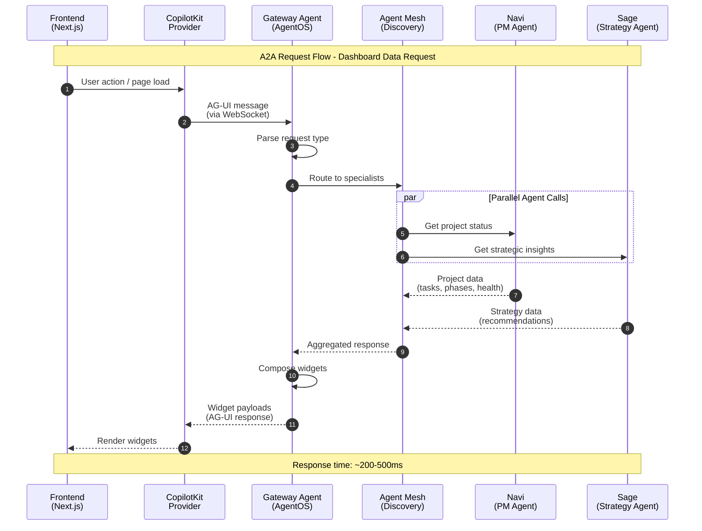
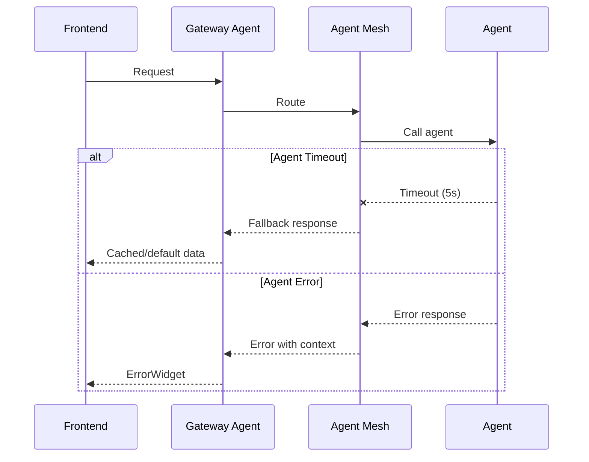

# A2A Request Flow

This diagram shows the complete flow of an Agent-to-Agent (A2A) request from the frontend through the agent mesh to specialist agents.

## Key Components

| Component | Role | Protocol |
|-----------|------|----------|
| Frontend | User interface, renders widgets | HTTP/WS |
| CopilotKit | AI interaction layer | AG-UI |
| Gateway Agent | Request orchestration | A2A |
| Agent Mesh | Discovery and routing | A2A |
| Specialist Agents | Domain-specific processing | A2A |

## Error Handling

## Related Documentation

- [Dynamic Module System Architecture](../dynamic-module-system.md)
- [Agent Mesh Topology](./agent-mesh-topology.md)
- [HITL Approval Flow](./hitl-approval-flow.md)
