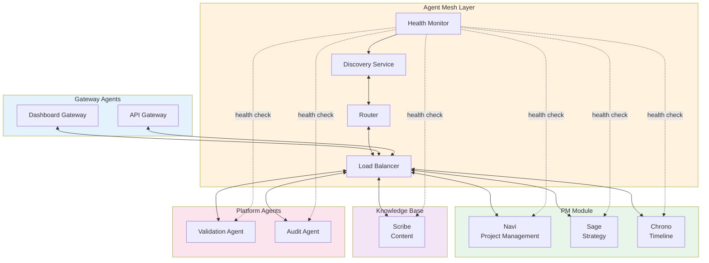
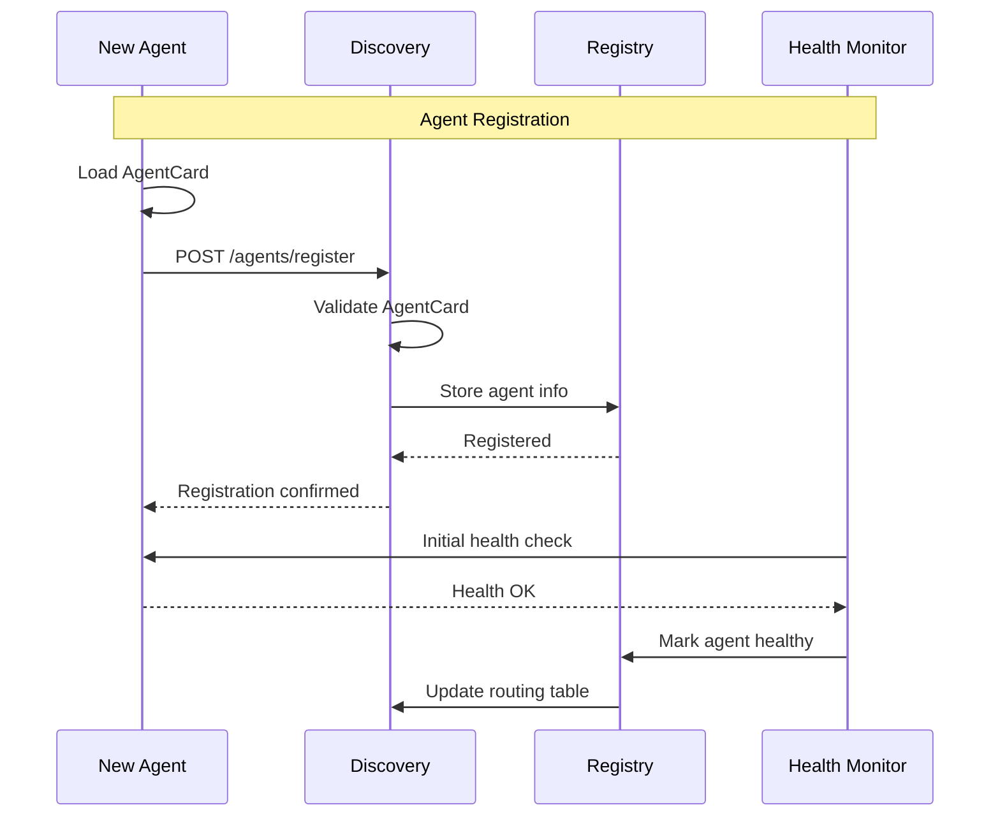
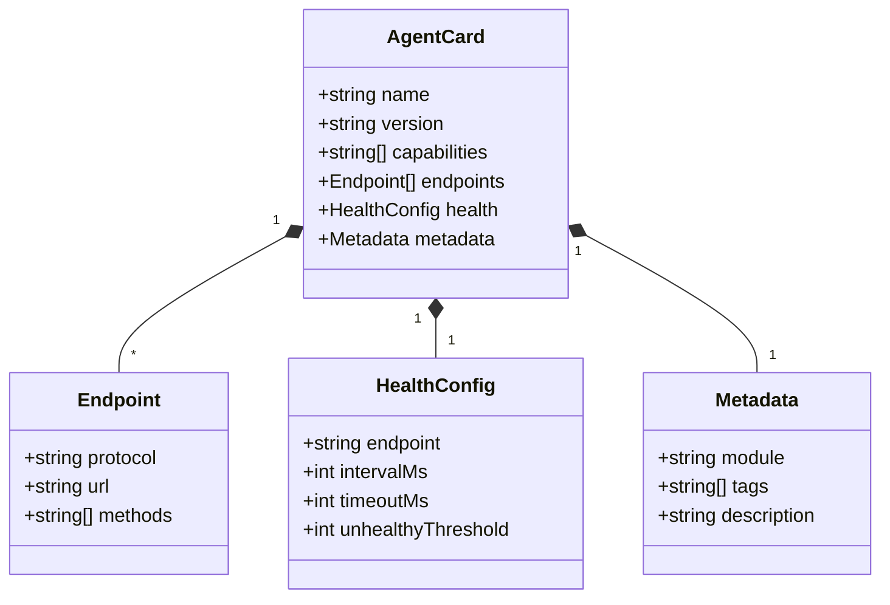
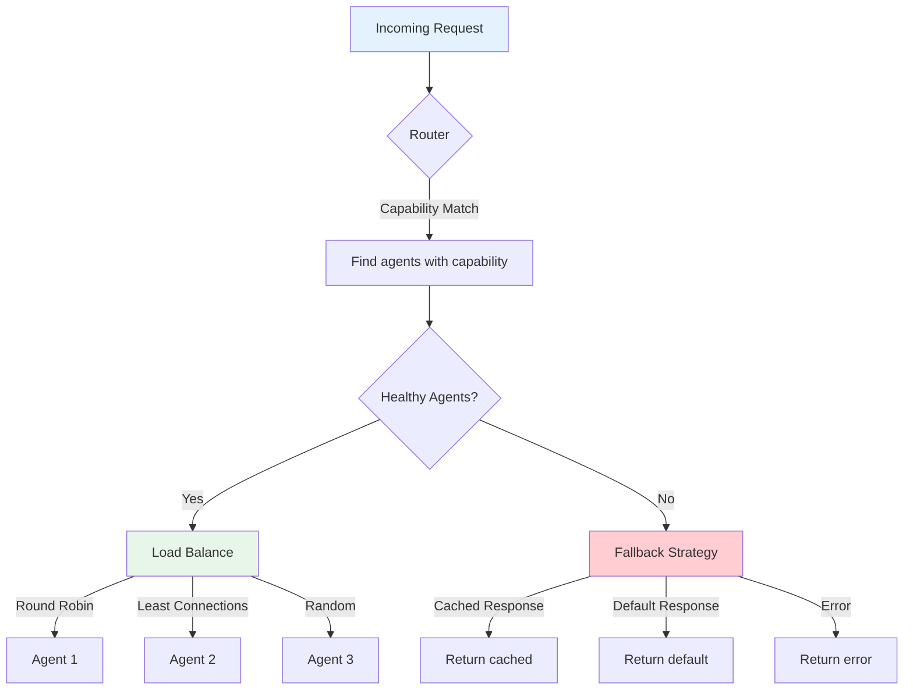
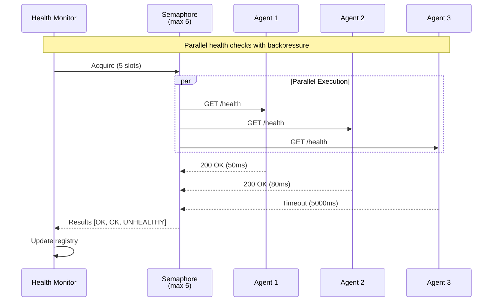
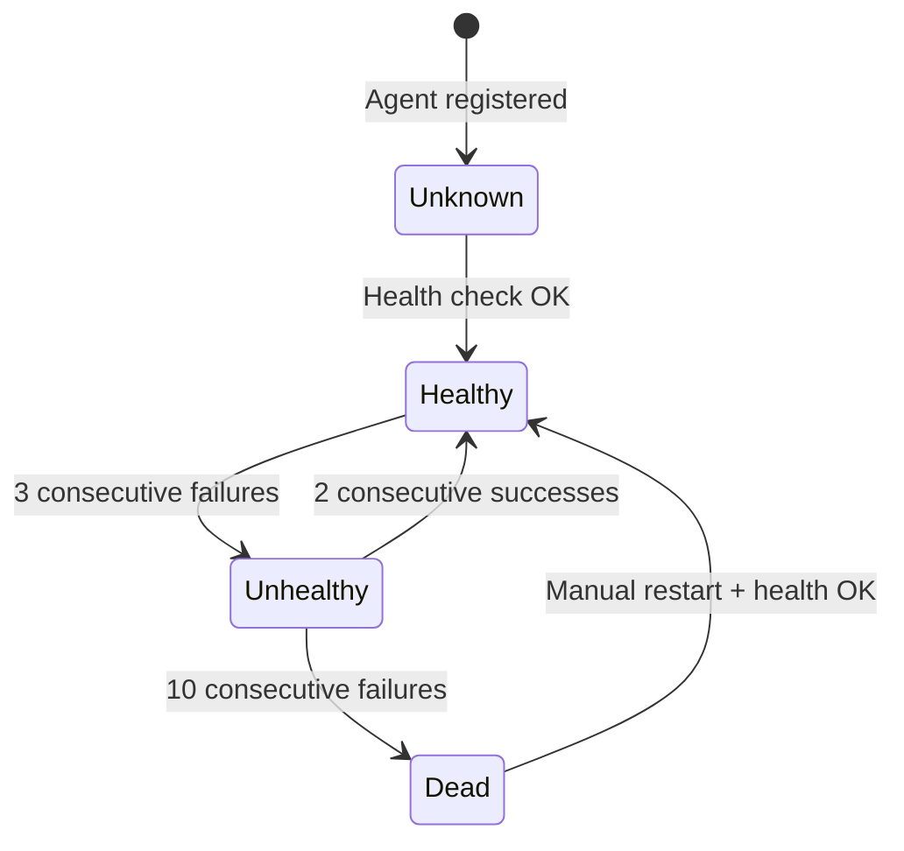
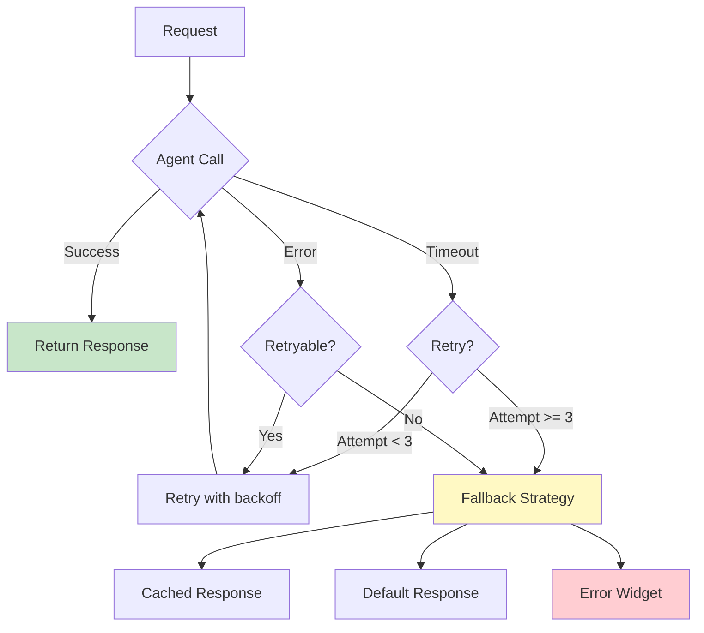

# Agent Mesh Topology

This diagram shows the agent discovery, routing, and health check architecture.

## Discovery Protocol

## Agent Card Schema

## Routing Strategy

## Health Check System

### Parallel Health Checks

### Health States

## Agent Capabilities

| Agent | Module | Capabilities | Dependencies |
|-------|--------|--------------|--------------|
| Navi | PM | project.status, task.manage, phase.track | PostgreSQL |
| Sage | PM | strategy.analyze, recommendation.generate | Navi, KB |
| Chrono | PM | timeline.manage, deadline.track | Navi |
| Scribe | KB | content.verify, kb.search, rag.query | pgvector |
| Dashboard Gateway | Platform | widget.compose, state.manage | All PM agents |

## Failure Handling

## Related Documentation

- [A2A Request Flow](./a2a-request-flow.md)
- [Dashboard Data Flow](./dashboard-data-flow.md)
- [A2A Troubleshooting Guide](../../runbooks/a2a-troubleshooting.md)
