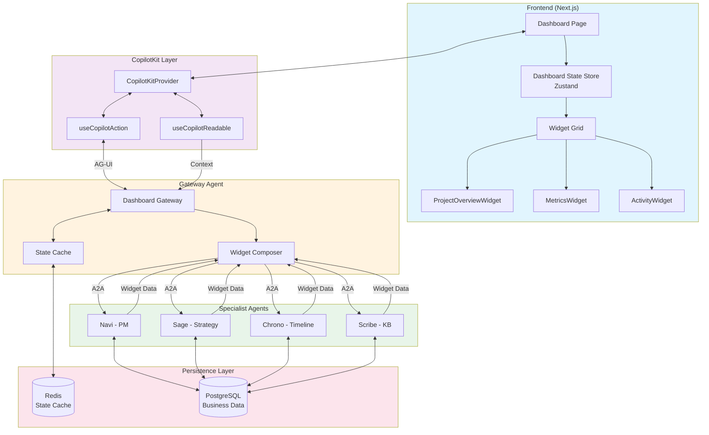
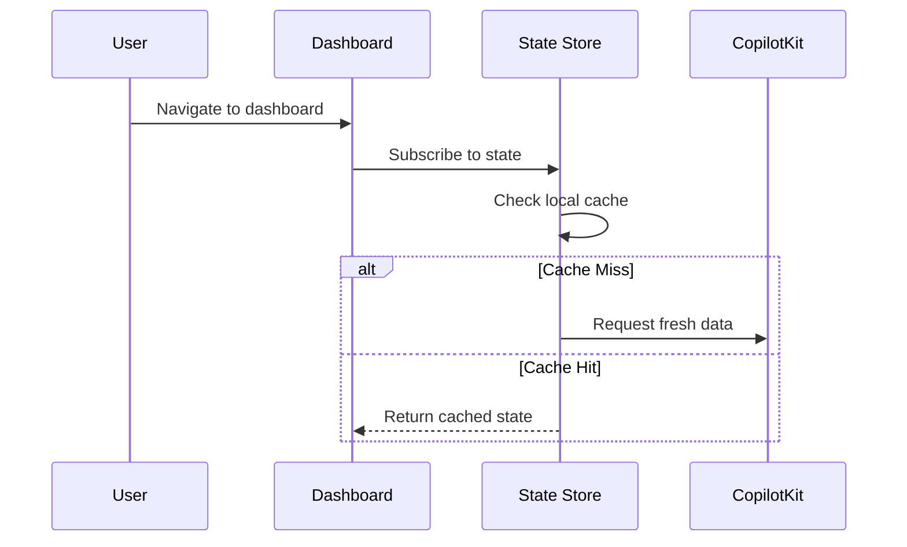
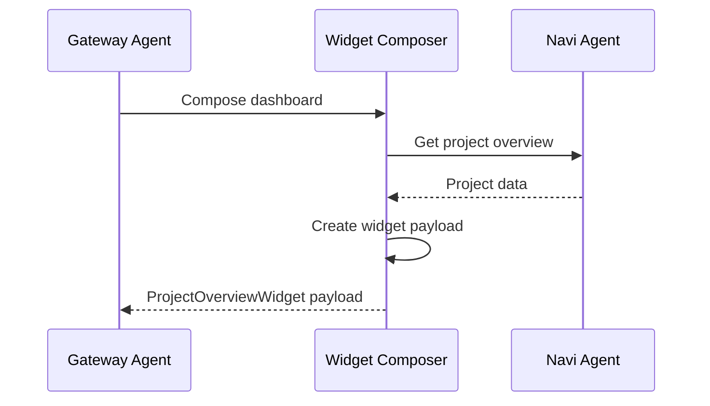
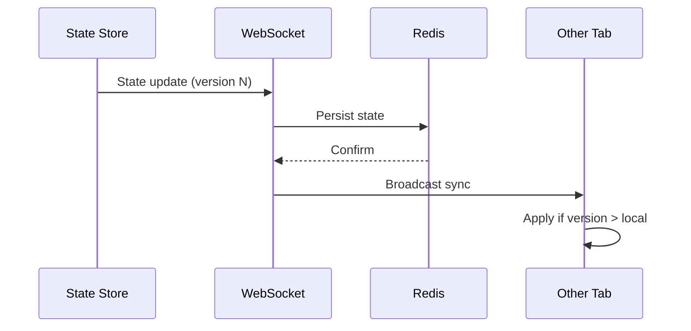

# Dashboard Data Flow

This diagram shows how data flows from widget requests through agents to final rendering on the dashboard.

## Data Flow Stages

### 1. Request Initiation

### 2. Widget Composition

### 3. State Synchronization

## Widget Types

| Widget | Data Source | Refresh Rate | Cache TTL |
|--------|-------------|--------------|-----------|
| ProjectOverview | Navi | On demand | 5 min |
| Metrics | Multiple agents | 30 sec | 1 min |
| Activity | Event stream | Real-time | No cache |
| Tasks | Navi | On demand | 5 min |
| Alerts | System events | Real-time | No cache |

## Related Documentation

- [A2A Request Flow](./a2a-request-flow.md)
- [State Sync System](../state-sync.md)
- [CopilotKit Patterns](../../guides/copilotkit-patterns.md)
