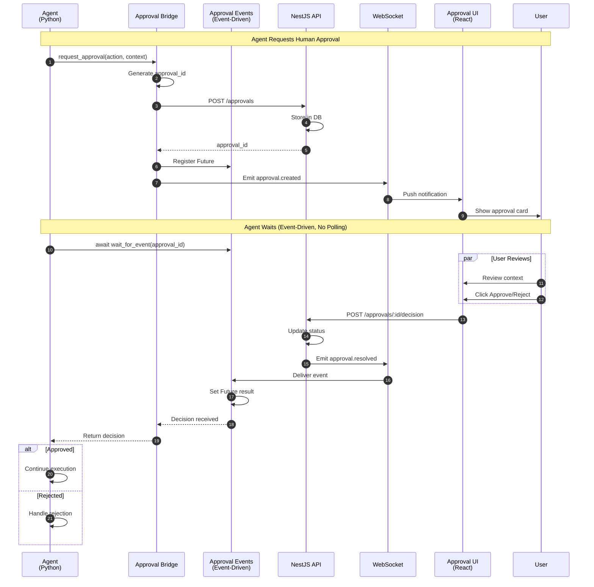
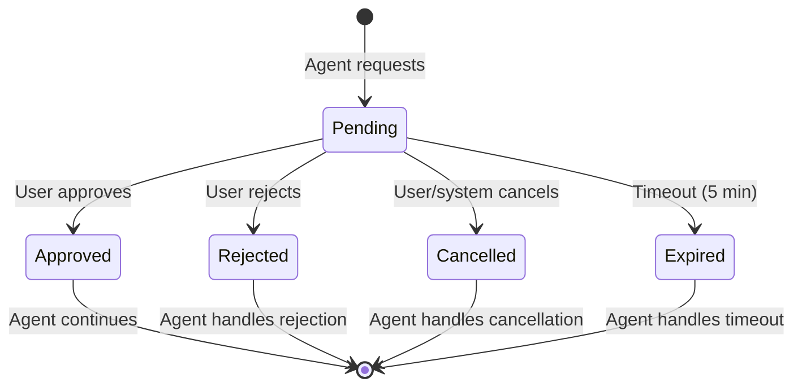
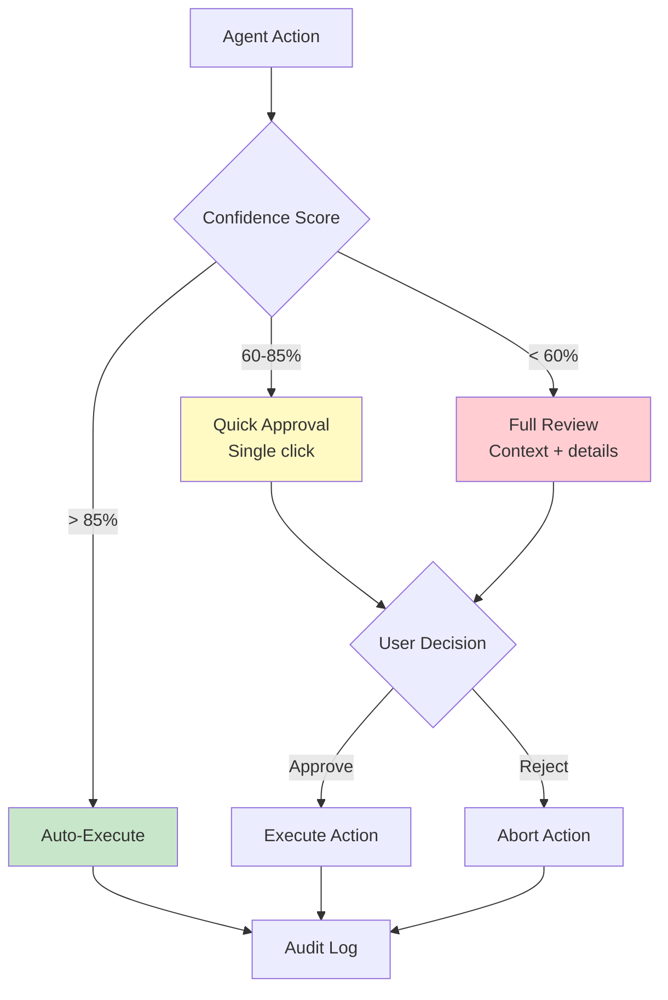
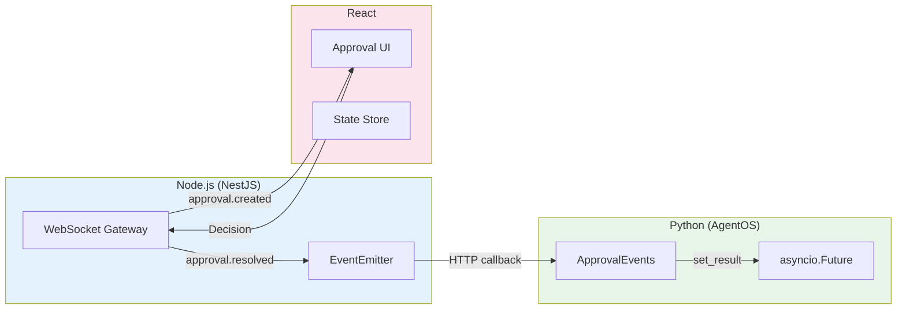
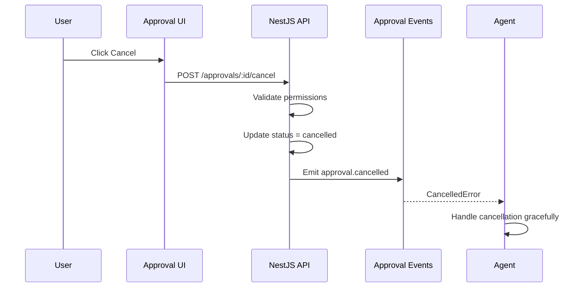

# HITL (Human-in-the-Loop) Approval Flow

This diagram shows how agents pause execution for human approval and resume after receiving a decision.

## Approval States

## Confidence-Based Routing

## Event-Driven Architecture

### Why Events Instead of Polling?

| Metric | Polling (Old) | Event-Driven (Current) |
|--------|---------------|------------------------|
| CPU during wait | ~1% | ~0% |
| Response latency | 0-5 seconds | <100ms |
| API calls per 5min | ~60 | 1 |
| Network overhead | High | Minimal |

### Event Flow

## Cancellation Flow

## Related Documentation

- [A2A Request Flow](./a2a-request-flow.md)
- [Async Primitive Patterns](../../guides/async-primitive-patterns.md)
- [Security Review Checklist](../../security/review-checklist.md)
