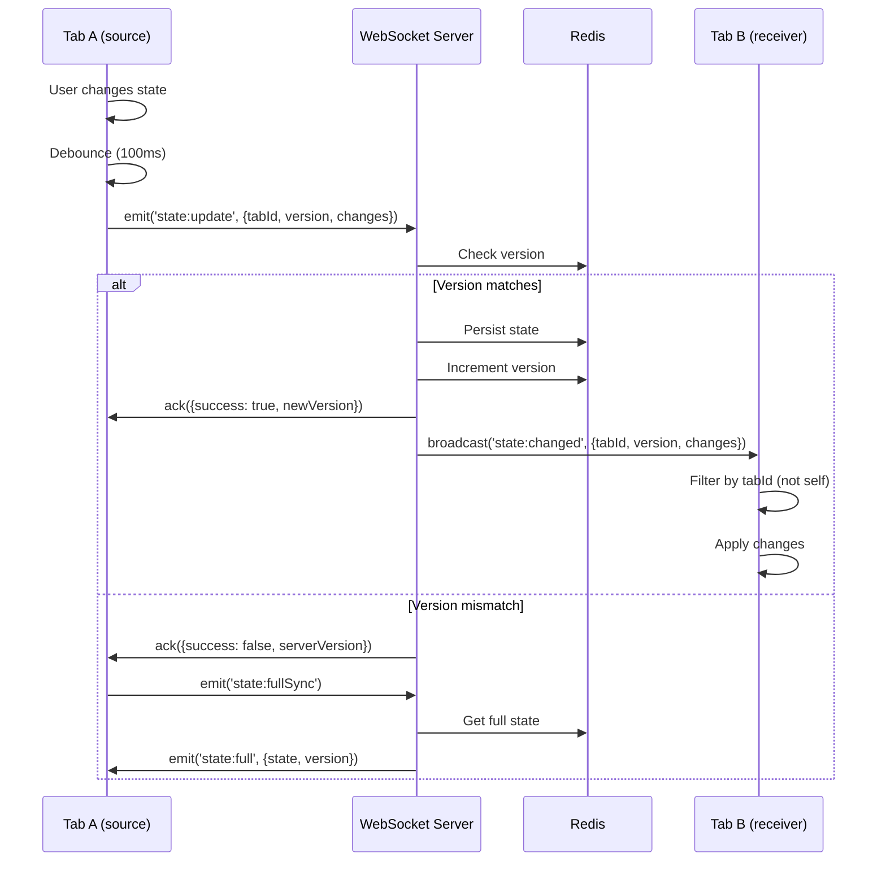
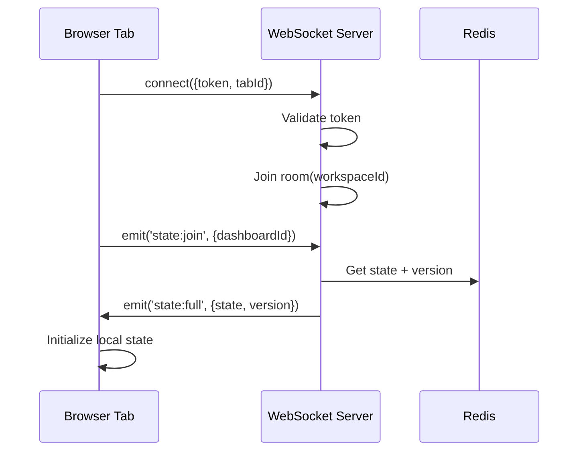

# Dashboard State Sync System

Architecture documentation for the Redis + WebSocket real-time state synchronization system.

## Overview

The state sync system enables real-time collaboration across browser tabs and devices by combining:
- **Redis** for persistent state storage and cross-instance coordination
- **WebSocket** for real-time push notifications
- **Version-based conflict detection** for optimistic updates

## Architecture

```
┌─────────────────────────────────────────────────────────────────┐
│                        Browser Instance                         │
├─────────────┬─────────────┬─────────────┬─────────────┬────────┤
│   Tab A     │   Tab B     │   Tab C     │   Tab D     │  ...   │
│  (source)   │  (receiver) │  (receiver) │  (receiver) │        │
│   tabId:1   │   tabId:2   │   tabId:3   │   tabId:4   │        │
└──────┬──────┴──────┬──────┴──────┬──────┴──────┬──────┴────────┘
       │             │             │             │
       └─────────────┴──────┬──────┴─────────────┘
                            │ WebSocket
                            ▼
┌─────────────────────────────────────────────────────────────────┐
│                       NestJS Gateway                            │
│                                                                 │
│  ┌─────────────────┐    ┌─────────────────┐                    │
│  │ RealtimeGateway │◀──▶│ StateService    │                    │
│  └─────────────────┘    └────────┬────────┘                    │
└──────────────────────────────────┼──────────────────────────────┘
                                   │
                                   ▼
┌─────────────────────────────────────────────────────────────────┐
│                          Redis                                  │
│                                                                 │
│  dashboard:{workspaceId}:{dashboardId}:state → JSON blob       │
│  dashboard:{workspaceId}:{dashboardId}:version → number        │
│  dashboard:{workspaceId}:{dashboardId}:lock → advisory lock    │
└─────────────────────────────────────────────────────────────────┘
```

## State Flow

### State Update Flow



### Initial Connection Flow



## Key Concepts

### Tab ID Management

Each browser tab gets a unique identifier to:
1. Prevent echo (receiving your own updates)
2. Enable tab-specific state tracking
3. Support cross-tab coordination

```typescript
// Client-side tab ID generation
const getOrCreateTabId = (): string => {
  let tabId = sessionStorage.getItem('tabId');
  if (!tabId) {
    tabId = crypto.randomUUID();
    sessionStorage.setItem('tabId', tabId);
  }
  return tabId;
};

// Server-side echo prevention
socket.on('state:changed', (data) => {
  if (data.sourceTabId !== myTabId) {
    applyStateChange(data.changes);
  }
});
```

### Version-Based Conflict Detection

Every state change increments a version number:

```typescript
interface StateUpdate {
  dashboardId: string;
  changes: Partial<DashboardState>;
  lastKnownVersion: number;
  sourceTabId: string;
}

// Server-side version check
async function applyUpdate(update: StateUpdate): Promise<UpdateResult> {
  const versionStr = await redis.get(`dashboard:${id}:version`);
  const currentVersion = parseInt(versionStr || '0', 10);

  if (update.lastKnownVersion !== currentVersion) {
    return { success: false, serverVersion: currentVersion };
  }

  await redis.multi()
    .set(`dashboard:${id}:state`, JSON.stringify(mergedState))
    .incr(`dashboard:${id}:version`)
    .exec();

  return { success: true, newVersion: currentVersion + 1 };
}
```

### Debouncing

Client-side debouncing prevents overwhelming the server:

```typescript
const debouncedSync = useMemo(
  () => debounce((changes: StateChanges) => {
    socket.emit('state:update', {
      tabId: getTabId(),
      version: lastVersion.current,
      changes,
    });
  }, 100),
  []
);
```

## State Schema

### Dashboard State Structure

```typescript
interface DashboardState {
  // Layout configuration
  layout: WidgetLayout[];

  // Widget-specific data
  widgets: Record<string, WidgetState>;

  // User preferences
  preferences: {
    refreshInterval: number;
    compactMode: boolean;
    theme: 'light' | 'dark' | 'system';
  };

  // Active filters
  filters: {
    dateRange: DateRange;
    projects: string[];
    agents: string[];
  };
}

interface WidgetLayout {
  id: string;
  type: string;
  position: { x: number; y: number };
  size: { width: number; height: number };
}
```

### Redis Key Structure

```
dashboard:{workspaceId}:{dashboardId}:state
dashboard:{workspaceId}:{dashboardId}:version
dashboard:{workspaceId}:{dashboardId}:connections
```

## State Compression

For large state payloads, compression is applied:

```typescript
// Server-side compression
import { compress, decompress } from 'lz-string';

const COMPRESSION_THRESHOLD = 10000; // 10KB

async function persistState(id: string, state: DashboardState) {
  const json = JSON.stringify(state);

  if (json.length > COMPRESSION_THRESHOLD) {
    const compressed = compress(json);
    await redis.set(`dashboard:${id}:state`, compressed);
    await redis.set(`dashboard:${id}:compressed`, 'true');
  } else {
    await redis.set(`dashboard:${id}:state`, json);
    await redis.del(`dashboard:${id}:compressed`);
  }
}
```

## Migration System

Schema evolution is handled via migrations:

```typescript
interface StateMigration {
  version: number;
  up: (state: unknown) => DashboardState;
  down: (state: DashboardState) => unknown;
}

const migrations: StateMigration[] = [
  {
    version: 2,
    up: (state: any) => ({
      ...state,
      preferences: state.preferences || { refreshInterval: 30000 },
    }),
    down: (state) => {
      const { preferences, ...rest } = state;
      return rest;
    },
  },
];

function migrateState(state: unknown, fromVersion: number): DashboardState {
  let current = state;
  for (const migration of migrations) {
    if (migration.version > fromVersion) {
      current = migration.up(current);
    }
  }
  return current as DashboardState;
}
```

## Room Management

### Room Naming Convention

```
workspace:{workspaceId}:dashboard:{dashboardId}
workspace:{workspaceId}:approvals
workspace:{workspaceId}:notifications
```

### Connection Tracking

```typescript
// Track active connections per room
interface RoomInfo {
  connections: Set<string>; // socket IDs
  lastActivity: number;
  version: number;
}

const rooms = new Map<string, RoomInfo>();

// Cleanup orphaned rooms
setInterval(() => {
  const now = Date.now();
  for (const [roomId, info] of rooms) {
    if (info.connections.size === 0 && now - info.lastActivity > 300000) {
      rooms.delete(roomId);
    }
  }
}, 60000);
```

## Error Handling

### Reconnection Recovery

```typescript
socket.on('disconnect', () => {
  setConnectionState('disconnected');
});

socket.on('connect', async () => {
  setConnectionState('connected');

  // Request full state sync on reconnection
  socket.emit('state:fullSync', {
    dashboardId,
    lastKnownVersion: localVersion,
  });
});
```

### Conflict Resolution

When version conflicts occur:

1. **Last-write-wins** (default): Server state takes precedence
2. **Merge**: Combine changes (for non-conflicting fields)
3. **User prompt**: Show conflict UI for manual resolution

```typescript
async function resolveConflict(
  local: DashboardState,
  server: DashboardState,
  strategy: 'server' | 'merge' | 'prompt'
): Promise<DashboardState> {
  switch (strategy) {
    case 'server':
      return server;
    case 'merge':
      return deepMerge(local, server);
    case 'prompt':
      return await showConflictDialog(local, server);
  }
}
```

## Performance Considerations

### Selective Updates

Only sync changed fields, not full state:

```typescript
// Generate minimal diff
function getStateChanges(
  prev: DashboardState,
  next: DashboardState
): Partial<DashboardState> {
  const changes: Partial<DashboardState> = {};

  for (const key of Object.keys(next) as (keyof DashboardState)[]) {
    if (!deepEqual(prev[key], next[key])) {
      changes[key] = next[key];
    }
  }

  return changes;
}
```

### Batching

Multiple rapid changes are batched:

```typescript
const pendingChanges: StateChange[] = [];
let batchTimeout: NodeJS.Timeout | null = null;

function queueChange(change: StateChange) {
  pendingChanges.push(change);

  if (!batchTimeout) {
    batchTimeout = setTimeout(() => {
      const batch = [...pendingChanges];
      pendingChanges.length = 0;
      batchTimeout = null;

      socket.emit('state:batchUpdate', { changes: batch });
    }, 100);
  }
}
```

## Development Guide

### Adding New Synchronized State

1. Update the `DashboardState` interface
2. Add migration if needed
3. Update Redis key documentation
4. Add to state sync subscription

```typescript
// Step 1: Update interface
interface DashboardState {
  // ... existing fields
  newFeature: NewFeatureState;
}

// Step 2: Add migration
migrations.push({
  version: 3,
  up: (state: any) => ({
    ...state,
    newFeature: { enabled: false },
  }),
  down: (state) => {
    const { newFeature, ...rest } = state;
    return rest;
  },
});

// Step 3: Subscribe to changes
useEffect(() => {
  socket.on('state:changed', (data) => {
    if (data.changes.newFeature) {
      setNewFeatureState(data.changes.newFeature);
    }
  });
}, []);
```

## Related Documentation

- [WebSocket Security](./websocket-security.md)
- [Real-time Architecture](./realtime-architecture.md)
- [CopilotKit Patterns](../guides/copilotkit-patterns.md)
