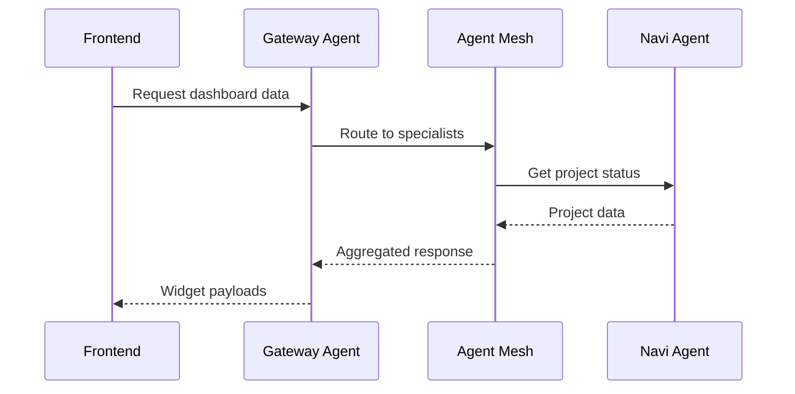

# Epic DM-10: Documentation & Developer Experience

## Overview

Address documentation gaps, improve developer tooling, and create comprehensive guides for the Dynamic Module System. This epic covers all documentation-related items from the [Tech Debt Consolidated Document](../tech-debt-consolidated.md).

## Source Reference

**Tech Debt Document:** `docs/modules/bm-dm/tech-debt-consolidated.md`
**Priority:** Sprint 3+ - Documentation & DX
**Items Addressed:** REC-08, REC-09, REC-13, REC-14, REC-21, REC-25, REC-26, TD-09, TD-10, Doc Gaps 1-6

## Scope

### Documentation Gaps

| # | Gap | Priority | Source Epic |
|---|-----|----------|-------------|
| 1 | Architecture diagrams for A2A flow | Medium | DM-03 |
| 2 | HTTP/2 deployment guide | Low | DM-03 |
| 3 | A2A troubleshooting guide | Low | DM-03 |
| 4 | MCP server configuration docs | Low | DM-06 |
| 5 | CopilotKit patterns central guide | Medium | DM-05 |
| 6 | Implementation notes backfill (DM-01.6-01.8, DM-02.5-02.9) | Medium | DM-01, DM-02 |

### Developer Experience Recommendations

| ID | Item | Category | Source Epic |
|----|------|----------|-------------|
| REC-08 | Create A2A flow architecture diagrams | Documentation | DM-03 |
| REC-09 | Add local Semgrep check to pre-commit | Security | DM-06 |
| REC-13 | HTTP/2 deployment guide and troubleshooting | Deployment | DM-03 |
| REC-14 | Common A2A troubleshooting guide | Operations | DM-03 |
| REC-21 | Document MCP server configuration | Documentation | DM-06 |
| REC-25 | Add Semgrep rules for common async pitfalls | Code Quality | DM-05 |
| REC-26 | Document CopilotKit patterns in central guide | Documentation | DM-05 |
| TD-09 | Missing implementation notes for DM-01.6 to DM-01.8 | Documentation | DM-01 |
| TD-10 | Missing implementation notes for DM-02.5 to DM-02.9 | Documentation | DM-02 |

## Proposed Stories

### Story DM-10.1: A2A Architecture Diagrams

**Problem:** No visual documentation of A2A request flows, making onboarding difficult.

**Gap Addressed:** Documentation Gap #1, REC-08

**Diagrams to Create:**
1. **A2A Request Flow** - Frontend → Gateway → Agent Mesh → Specialist Agents
2. **Dashboard Data Flow** - Widget request → A2A → State update → Render
3. **HITL Approval Flow** - Agent pause → Frontend approval → Resume
4. **Agent Mesh Topology** - Discovery, routing, health checks

**Implementation:**
- Use Excalidraw or Mermaid for diagrams
- Embed in architecture documentation
- Create both high-level overview and detailed sequence diagrams

**Diagram Examples:**


**Files to Create:**
```
docs/architecture/
├── diagrams/
│   ├── a2a-request-flow.excalidraw
│   ├── dashboard-data-flow.excalidraw
│   ├── hitl-approval-flow.excalidraw
│   └── agent-mesh-topology.excalidraw
└── dynamic-module-system.md (embed diagrams)
```

**Acceptance Criteria:**
- [ ] AC1: A2A request flow diagram created
- [ ] AC2: Dashboard data flow diagram created
- [ ] AC3: HITL approval flow diagram created
- [ ] AC4: Agent mesh topology diagram created
- [ ] AC5: Diagrams embedded in architecture docs

**Points:** 5

---

### Story DM-10.2: CopilotKit Patterns Guide

**Problem:** No central documentation for CopilotKit usage patterns in this project.

**Gap Addressed:** Documentation Gap #5, REC-26

**Patterns to Document:**
1. **useCopilotAction** - Tool call handling
2. **useCopilotReadable** - Context exposure
3. **useHumanInTheLoop** - Approval workflows
4. **useGenerativeLayout** - Dynamic UI composition
5. **State synchronization** - Backend ↔ Frontend state

**Guide Structure:**
```markdown
# CopilotKit Patterns Guide

## Overview
How we use CopilotKit in the Dynamic Module System.

## Pattern 1: Tool Call Handling
- When to use useCopilotAction
- Error handling patterns
- Response formatting

## Pattern 2: Context Exposure
- What to expose via useCopilotReadable
- Performance considerations
- Filtering sensitive data

## Pattern 3: Human-in-the-Loop
- Approval card components
- Timeout handling
- Cancel/reject flows

## Pattern 4: Generative UI
- Layout types and when to use each
- Dynamic widget composition
- Agent-driven UI patterns

## Anti-Patterns
- What NOT to do
- Common mistakes and fixes
```

**Files to Create:**
```
docs/guides/
└── copilotkit-patterns.md
```

**Acceptance Criteria:**
- [ ] AC1: All 5 patterns documented with examples
- [ ] AC2: Anti-patterns section included
- [ ] AC3: Code examples from actual codebase
- [ ] AC4: Links to relevant CopilotKit docs
- [ ] AC5: Reviewed by team for accuracy

**Points:** 5

---

### Story DM-10.3: MCP Server Configuration Guide

**Problem:** MCP server setup undocumented, making integration difficult.

**Gap Addressed:** Documentation Gap #4, REC-21

**Topics to Cover:**
1. What MCP servers are available (GitHub, Filesystem, custom)
2. Configuration file format and location
3. Adding new MCP servers
4. Troubleshooting connection issues
5. Security considerations

**Guide Structure:**
```markdown
# MCP Server Configuration

## Available MCP Servers
- GitHub MCP: Repository access
- Filesystem MCP: Local file operations
- Custom servers: How to add

## Configuration
Location: `agents/config/mcp.yaml`

```yaml
mcp_servers:
  github:
    command: "npx"
    args: ["-y", "@anthropic-ai/mcp-server-github"]
    env:
      GITHUB_TOKEN: ${GITHUB_TOKEN}

  filesystem:
    command: "npx"
    args: ["-y", "@anthropic-ai/mcp-server-filesystem"]
    allowed_paths:
      - ${PROJECT_ROOT}/src
```

## Adding Custom Servers
1. Create server implementation
2. Add to mcp.yaml
3. Restart agent system

## Troubleshooting
- Connection timeouts
- Permission errors
- Tool not found
```

**Files to Create:**
```
docs/guides/
└── mcp-configuration.md
```

**Acceptance Criteria:**
- [ ] AC1: All current MCP servers documented
- [ ] AC2: Configuration format explained
- [ ] AC3: Custom server addition guide
- [ ] AC4: Troubleshooting section
- [ ] AC5: Security best practices

**Points:** 3

---

### Story DM-10.4: A2A Troubleshooting Guide

**Problem:** No operational guide for diagnosing A2A issues.

**Gap Addressed:** Documentation Gap #3, REC-14

**Topics to Cover:**
1. Common error codes and meanings
2. Health check interpretation
3. Agent discovery issues
4. Timeout and retry debugging
5. Log analysis patterns

**Troubleshooting Scenarios:**
```markdown
## Common Issues

### Agent Not Responding (504 Gateway Timeout)
**Symptoms:** Dashboard widgets show loading forever
**Diagnosis:**
1. Check agent health: `curl http://localhost:8000/health`
2. Check agent logs: `docker logs agent-container`
3. Check mesh status: `curl http://localhost:8000/mesh/status`

**Solutions:**
- Restart agent container
- Check Redis connection
- Verify model API keys

### Agent Not Found (404)
**Symptoms:** "Agent not registered" error
**Diagnosis:**
1. Check discovery: `curl http://localhost:8000/agents`
2. Verify agent card: Check `agent_card.json`

**Solutions:**
- Re-register agent
- Check naming consistency
```

**Files to Create:**
```
docs/runbooks/
└── a2a-troubleshooting.md
```

**Acceptance Criteria:**
- [ ] AC1: 10+ common issues documented
- [ ] AC2: Diagnosis steps for each issue
- [ ] AC3: Solution steps with commands
- [ ] AC4: Log examples included
- [ ] AC5: Links to monitoring dashboards

**Points:** 5

---

### Story DM-10.5: HTTP/2 Deployment Guide

**Problem:** HTTP/2 deployment and troubleshooting undocumented.

**Gap Addressed:** Documentation Gap #2, REC-13

**Topics to Cover:**
1. Why HTTP/2 for A2A communication
2. Server configuration (Nginx, Caddy)
3. TLS requirements
4. Load balancer setup
5. Troubleshooting common issues

**Guide Structure:**
```markdown
# HTTP/2 Deployment Guide

## Why HTTP/2?
- Multiplexing for parallel A2A calls
- Header compression
- Server push for proactive updates

## Server Configuration

### Nginx
```nginx
server {
    listen 443 ssl http2;
    ssl_certificate /path/to/cert.pem;
    ssl_certificate_key /path/to/key.pem;

    location /a2a {
        grpc_pass grpc://agent-mesh:50051;
    }
}
```

### Caddy
```caddyfile
:443 {
    tls /path/to/cert.pem /path/to/key.pem
    reverse_proxy /a2a/* agent-mesh:8000 {
        transport http {
            versions h2c 2
        }
    }
}
```

## Troubleshooting
- Protocol negotiation failures
- Certificate issues
- Proxy configuration
```

**Files to Create:**
```
docs/guides/
└── http2-deployment.md
```

**Acceptance Criteria:**
- [ ] AC1: Nginx configuration documented
- [ ] AC2: Caddy configuration documented
- [ ] AC3: TLS requirements explained
- [ ] AC4: Load balancer setup covered
- [ ] AC5: Troubleshooting section

**Points:** 3

---

### Story DM-10.6: Implementation Notes Backfill

**Problem:** Stories DM-01.6-01.8 and DM-02.5-02.9 lack implementation notes.

**Gap Addressed:** TD-09, TD-10, Documentation Gap #6

**Stories Needing Notes:**
- DM-01.6: CCR Routing Settings UI
- DM-01.7: CCR Connection Status
- DM-01.8: CCR Quota Usage Display
- DM-02.5: Existing Agent Protocol Updates
- DM-02.6: CCR Installation Configuration
- DM-02.7: CCR Agno Integration
- DM-02.8: CCR Task-Based Routing
- DM-02.9: CCR Usage Monitoring Alerts

**Implementation:**
- Review git history for each story
- Document what was actually implemented
- Note any deviations from original spec
- Add files changed and key decisions

**Notes Format:**
```markdown
## Implementation Notes

### What Was Built
- Component X created at path Y
- Integration with Z added

### Key Decisions
- Chose approach A over B because...
- Deferred feature C to future sprint

### Files Changed
- `apps/web/src/components/ccr/...`
- `agents/ccr/...`

### Testing
- Unit tests added: X
- Integration tests: Y
```

**Files to Update:**
```
docs/modules/bm-dm/stories/
├── dm-01-6-*.md
├── dm-01-7-*.md
├── dm-01-8-*.md
├── dm-02-5-*.md
├── dm-02-6-*.md
├── dm-02-7-*.md
├── dm-02-8-*.md
└── dm-02-9-*.md
```

**Acceptance Criteria:**
- [ ] AC1: All 8 stories have implementation notes
- [ ] AC2: Files changed listed for each
- [ ] AC3: Key decisions documented
- [ ] AC4: Deviations from spec noted
- [ ] AC5: Notes match actual implementation

**Points:** 5

---

### Story DM-10.7: Semgrep Pre-Commit Integration

**Problem:** Security issues caught late in review, not at commit time.

**Gap Addressed:** REC-09, REC-25

**Implementation:**
- Add Semgrep to pre-commit hooks
- Create custom rules for async pitfalls
- Configure appropriate rule sets
- Document how to run locally

**Custom Rules for Async Pitfalls:**
```yaml
rules:
  - id: missing-await-on-async
    pattern: |
      $FUNC(...)
    pattern-inside: |
      async def $FN(...):
        ...
    message: "Async function call may be missing await"
    severity: WARNING

  - id: asyncmock-without-spec
    pattern: |
      AsyncMock()
    message: "AsyncMock should specify spec for type safety"
    severity: INFO
```

**Files to Create/Modify:**
```
.semgrep/
├── rules/
│   ├── async-pitfalls.yaml
│   └── security-custom.yaml
└── .semgrep.yaml

.husky/
└── pre-commit (add semgrep)
```

**Acceptance Criteria:**
- [ ] AC1: Semgrep runs on pre-commit
- [ ] AC2: Custom async pitfall rules active
- [ ] AC3: Findings block commit (configurable)
- [ ] AC4: Clear instructions to install Semgrep
- [ ] AC5: Rules documented

**Points:** 3

---

## Total Points: 29

## Dependencies

- DM-07 (Need stable codebase to document)
- No blocking dependencies for documentation work

## Recommendations from DM-08 Retrospective

The following items from the DM-08 retrospective should be incorporated:

### From "What Went Well" Patterns

1. **Document widget type sync pattern** - When implementing DM-10.2 (CopilotKit Patterns Guide) or creating a dedicated guide, document:
   - `packages/shared/widget-types.json` as single source of truth
   - TypeScript exports from `packages/shared/src/types/widget.ts`
   - Python loading from JSON in `agents/gateway/tools.py`
   - Build validation script `scripts/validate-widget-types.ts`

2. **Add caching configuration guide** - Create a guide covering:
   - `agents/services/cache.py` - Cache service architecture
   - TTL configuration (currently hardcoded, recommend environment variables - see DM-11)
   - Staleness tracking and cache invalidation strategies
   - Integration with React Query on frontend

3. **Document Zustand selector optimization patterns** - Include in DM-10.2 or a dedicated guide:
   - Pre-computed derived state pattern (`activeAlerts`)
   - MAX bounds for collections (50 alerts, 100 activities, 50 metrics, 20 tasks)
   - `useShallow` for array/object selectors
   - Before/after examples showing re-render prevention

### From "What Could Be Improved"

4. **Document cross-language type validation approach** - When documenting the widget type sync pattern:
   - Explain the current JSON intermediate format approach
   - Note the limitation: lacks compile-time validation
   - Reference DM-11 for potential code generation implementation
   - Provide troubleshooting guide for type mismatch errors between TS and Python

## Technical Notes

### Excalidraw Integration

Excalidraw diagrams can be:
1. Created at [excalidraw.com](https://excalidraw.com)
2. Saved as `.excalidraw` files in repo
3. Exported as SVG for embedding in markdown

### Mermaid in GitHub

GitHub renders Mermaid diagrams natively in markdown:
```markdown

```

## Risks

1. **Documentation Staleness** - Code may change after docs written
2. **Diagram Maintenance** - Visual docs harder to keep current
3. **Adoption** - Devs may not read docs

## Success Criteria

- New developers can onboard using docs alone
- Troubleshooting guide reduces support requests
- Security issues caught at commit time
- All stories have traceable implementation notes

## References

- [Tech Debt Consolidated](../tech-debt-consolidated.md) - Source document
- [DM-01 Retrospective](../retrospectives/epic-dm-01-retro-2025-12-30.md) - TD-09
- [DM-02 Retrospective](../retrospectives/epic-dm-02-retro-2025-12-30.md) - TD-10
- [DM-03 Retrospective](epic-dm-03-retrospective.md) - REC-08, REC-13, REC-14
- [DM-05 Retrospective](../../sprint-artifacts/epic-dm-05-retrospective.md) - REC-25, REC-26
- [DM-06 Retrospective](epic-dm-06-retrospective.md) - REC-21
- [Semgrep Documentation](https://semgrep.dev/docs/)
