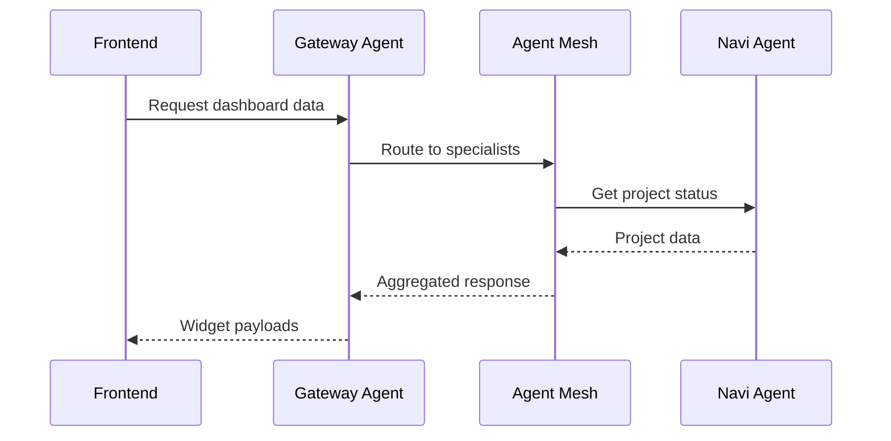

# Epic DM-10: Documentation & Developer Experience

## Overview

Address documentation gaps, improve developer tooling, and create comprehensive guides for the Dynamic Module System. This epic covers all documentation-related items from the [Tech Debt Consolidated Document](../tech-debt-consolidated.md).

## Source Reference

**Tech Debt Document:** `docs/modules/bm-dm/tech-debt-consolidated.md`
**Priority:** Sprint 3+ - Documentation & DX
**Items Addressed:** REC-08, REC-09, REC-13, REC-14, REC-21, REC-25, REC-26, TD-09, TD-10, TD-21, TD-23, Doc Gaps 1-6, DM-09 Retrospective Recommendations 1-3, DM-11 Retrospective Recommendations 1-5

## Scope

### Documentation Gaps

| # | Gap | Priority | Source Epic |
|---|-----|----------|-------------|
| 1 | Architecture diagrams for A2A flow | Medium | DM-03 |
| 2 | HTTP/2 deployment guide | Low | DM-03 |
| 3 | A2A troubleshooting guide | Low | DM-03 |
| 4 | MCP server configuration docs | Low | DM-06 |
| 5 | CopilotKit patterns central guide | Medium | DM-05 |
| 6 | Implementation notes backfill (DM-01.6-01.8, DM-02.5-02.9) | Medium | DM-01, DM-02 |
| 7 | State sync system documentation | Medium | DM-11 |
| 8 | Event-driven approval patterns | Medium | DM-11 |
| 9 | WebSocket security in production | High | DM-11 |
| 10 | Metrics auth key rotation runbook | Low | DM-11 |
| 11 | Async primitive patterns (Future vs Event) | Medium | DM-11 |

### Developer Experience Recommendations

| ID | Item | Category | Source Epic |
|----|------|----------|-------------|
| REC-08 | Create A2A flow architecture diagrams | Documentation | DM-03 |
| REC-09 | Add local Semgrep check to pre-commit | Security | DM-06 |
| REC-13 | HTTP/2 deployment guide and troubleshooting | Deployment | DM-03 |
| REC-14 | Common A2A troubleshooting guide | Operations | DM-03 |
| REC-21 | Document MCP server configuration | Documentation | DM-06 |
| REC-25 | Add Semgrep rules for common async pitfalls | Code Quality | DM-05 |
| REC-26 | Document CopilotKit patterns in central guide | Documentation | DM-05 |
| TD-09 | Missing implementation notes for DM-01.6 to DM-01.8 | Documentation | DM-01 |
| TD-10 | Missing implementation notes for DM-02.5 to DM-02.9 | Documentation | DM-02 |
| TD-21 | WebSocket room cleanup comprehensive testing | Testing | DM-11 |
| TD-23 | Metrics auth key rotation documentation | Operations | DM-11 |
| REC-27 | Security review checklist for PRs | Security | DM-11 |
| REC-28 | Async primitive guidelines (Future vs Event) | Code Quality | DM-11 |
| REC-29 | PR size limits documentation | Process | DM-11 |
| REC-30 | Comment hygiene in PR template | Code Quality | DM-11 |
| REC-31 | Production security defaults documentation | Security | DM-11 |

## Proposed Stories

### Story DM-10.1: A2A Architecture Diagrams

**Problem:** No visual documentation of A2A request flows, making onboarding difficult.

**Gap Addressed:** Documentation Gap #1, REC-08

**Diagrams to Create:**
1. **A2A Request Flow** - Frontend → Gateway → Agent Mesh → Specialist Agents
2. **Dashboard Data Flow** - Widget request → A2A → State update → Render
3. **HITL Approval Flow** - Agent pause → Frontend approval → Resume
4. **Agent Mesh Topology** - Discovery, routing, health checks

**Implementation:**
- Use Excalidraw or Mermaid for diagrams
- Embed in architecture documentation
- Create both high-level overview and detailed sequence diagrams

**Diagram Examples:**


**Files to Create:**
```
docs/architecture/
├── diagrams/
│   ├── a2a-request-flow.excalidraw
│   ├── dashboard-data-flow.excalidraw
│   ├── hitl-approval-flow.excalidraw
│   └── agent-mesh-topology.excalidraw
└── dynamic-module-system.md (embed diagrams)
```

**Acceptance Criteria:**
- [ ] AC1: A2A request flow diagram created
- [ ] AC2: Dashboard data flow diagram created
- [ ] AC3: HITL approval flow diagram created
- [ ] AC4: Agent mesh topology diagram created
- [ ] AC5: Diagrams embedded in architecture docs

**Points:** 5

---

### Story DM-10.2: CopilotKit Patterns Guide

**Problem:** No central documentation for CopilotKit usage patterns in this project.

**Gap Addressed:** Documentation Gap #5, REC-26

**Patterns to Document:**
1. **useCopilotAction** - Tool call handling
2. **useCopilotReadable** - Context exposure
3. **useHumanInTheLoop** - Approval workflows
4. **useGenerativeLayout** - Dynamic UI composition
5. **State synchronization** - Backend ↔ Frontend state

**Guide Structure:**
```markdown
# CopilotKit Patterns Guide

## Overview
How we use CopilotKit in the Dynamic Module System.

## Pattern 1: Tool Call Handling
- When to use useCopilotAction
- Error handling patterns
- Response formatting

## Pattern 2: Context Exposure
- What to expose via useCopilotReadable
- Performance considerations
- Filtering sensitive data

## Pattern 3: Human-in-the-Loop
- Approval card components
- Timeout handling
- Cancel/reject flows

## Pattern 4: Generative UI
- Layout types and when to use each
- Dynamic widget composition
- Agent-driven UI patterns

## Anti-Patterns
- What NOT to do
- Common mistakes and fixes
```

**Files to Create:**
```
docs/guides/
└── copilotkit-patterns.md
```

**Acceptance Criteria:**
- [ ] AC1: All 5 patterns documented with examples
- [ ] AC2: Anti-patterns section included
- [ ] AC3: Code examples from actual codebase
- [ ] AC4: Links to relevant CopilotKit docs
- [ ] AC5: Reviewed by team for accuracy

**Points:** 5

---

### Story DM-10.3: MCP Server Configuration Guide

**Problem:** MCP server setup undocumented, making integration difficult.

**Gap Addressed:** Documentation Gap #4, REC-21

**Topics to Cover:**
1. What MCP servers are available (GitHub, Filesystem, custom)
2. Configuration file format and location
3. Adding new MCP servers
4. Troubleshooting connection issues
5. Security considerations

**Guide Structure:**
```markdown
# MCP Server Configuration

## Available MCP Servers
- GitHub MCP: Repository access
- Filesystem MCP: Local file operations
- Custom servers: How to add

## Configuration
Location: `agents/config/mcp.yaml`

```yaml
mcp_servers:
  github:
    command: "npx"
    args: ["-y", "@anthropic-ai/mcp-server-github"]
    env:
      GITHUB_TOKEN: ${GITHUB_TOKEN}

  filesystem:
    command: "npx"
    args: ["-y", "@anthropic-ai/mcp-server-filesystem"]
    allowed_paths:
      - ${PROJECT_ROOT}/src
```

## Adding Custom Servers
1. Create server implementation
2. Add to mcp.yaml
3. Restart agent system

## Troubleshooting
- Connection timeouts
- Permission errors
- Tool not found
```

**Files to Create:**
```
docs/guides/
└── mcp-configuration.md
```

**Acceptance Criteria:**
- [ ] AC1: All current MCP servers documented
- [ ] AC2: Configuration format explained
- [ ] AC3: Custom server addition guide
- [ ] AC4: Troubleshooting section
- [ ] AC5: Security best practices

**Points:** 3

---

### Story DM-10.4: A2A Troubleshooting Guide

**Problem:** No operational guide for diagnosing A2A issues.

**Gap Addressed:** Documentation Gap #3, REC-14

**Topics to Cover:**
1. Common error codes and meanings
2. Health check interpretation
3. Agent discovery issues
4. Timeout and retry debugging
5. Log analysis patterns

**Troubleshooting Scenarios:**
```markdown
## Common Issues

### Agent Not Responding (504 Gateway Timeout)
**Symptoms:** Dashboard widgets show loading forever
**Diagnosis:**
1. Check agent health: `curl http://localhost:8000/health`
2. Check agent logs: `docker logs agent-container`
3. Check mesh status: `curl http://localhost:8000/mesh/status`

**Solutions:**
- Restart agent container
- Check Redis connection
- Verify model API keys

### Agent Not Found (404)
**Symptoms:** "Agent not registered" error
**Diagnosis:**
1. Check discovery: `curl http://localhost:8000/agents`
2. Verify agent card: Check `agent_card.json`

**Solutions:**
- Re-register agent
- Check naming consistency
```

**Files to Create:**
```
docs/runbooks/
└── a2a-troubleshooting.md
```

**Acceptance Criteria:**
- [ ] AC1: 10+ common issues documented
- [ ] AC2: Diagnosis steps for each issue
- [ ] AC3: Solution steps with commands
- [ ] AC4: Log examples included
- [ ] AC5: Links to monitoring dashboards

**Points:** 5

---

### Story DM-10.5: HTTP/2 Deployment Guide

**Problem:** HTTP/2 deployment and troubleshooting undocumented.

**Gap Addressed:** Documentation Gap #2, REC-13

**Topics to Cover:**
1. Why HTTP/2 for A2A communication
2. Server configuration (Nginx, Caddy)
3. TLS requirements
4. Load balancer setup
5. Troubleshooting common issues

**Guide Structure:**
```markdown
# HTTP/2 Deployment Guide

## Why HTTP/2?
- Multiplexing for parallel A2A calls
- Header compression
- Server push for proactive updates

## Server Configuration

### Nginx
```nginx
server {
    listen 443 ssl http2;
    ssl_certificate /path/to/cert.pem;
    ssl_certificate_key /path/to/key.pem;

    location /a2a {
        grpc_pass grpc://agent-mesh:50051;
    }
}
```

### Caddy
```caddyfile
:443 {
    tls /path/to/cert.pem /path/to/key.pem
    reverse_proxy /a2a/* agent-mesh:8000 {
        transport http {
            versions h2c 2
        }
    }
}
```

## Troubleshooting
- Protocol negotiation failures
- Certificate issues
- Proxy configuration
```

**Files to Create:**
```
docs/guides/
└── http2-deployment.md
```

**Acceptance Criteria:**
- [ ] AC1: Nginx configuration documented
- [ ] AC2: Caddy configuration documented
- [ ] AC3: TLS requirements explained
- [ ] AC4: Load balancer setup covered
- [ ] AC5: Troubleshooting section

**Points:** 3

---

### Story DM-10.6: Implementation Notes Backfill

**Problem:** Stories DM-01.6-01.8 and DM-02.5-02.9 lack implementation notes.

**Gap Addressed:** TD-09, TD-10, Documentation Gap #6

**Stories Needing Notes:**
- DM-01.6: CCR Routing Settings UI
- DM-01.7: CCR Connection Status
- DM-01.8: CCR Quota Usage Display
- DM-02.5: Existing Agent Protocol Updates
- DM-02.6: CCR Installation Configuration
- DM-02.7: CCR Agno Integration
- DM-02.8: CCR Task-Based Routing
- DM-02.9: CCR Usage Monitoring Alerts

**Implementation:**
- Review git history for each story
- Document what was actually implemented
- Note any deviations from original spec
- Add files changed and key decisions

**Notes Format:**
```markdown
## Implementation Notes

### What Was Built
- Component X created at path Y
- Integration with Z added

### Key Decisions
- Chose approach A over B because...
- Deferred feature C to future sprint

### Files Changed
- `apps/web/src/components/ccr/...`
- `agents/ccr/...`

### Testing
- Unit tests added: X
- Integration tests: Y
```

**Files to Update:**
```
docs/modules/bm-dm/stories/
├── dm-01-6-*.md
├── dm-01-7-*.md
├── dm-01-8-*.md
├── dm-02-5-*.md
├── dm-02-6-*.md
├── dm-02-7-*.md
├── dm-02-8-*.md
└── dm-02-9-*.md
```

**Acceptance Criteria:**
- [ ] AC1: All 8 stories have implementation notes
- [ ] AC2: Files changed listed for each
- [ ] AC3: Key decisions documented
- [ ] AC4: Deviations from spec noted
- [ ] AC5: Notes match actual implementation

**Points:** 5

---

### Story DM-10.7: Semgrep Pre-Commit Integration

**Problem:** Security issues caught late in review, not at commit time.

**Gap Addressed:** REC-09, REC-25

**Implementation:**
- Add Semgrep to pre-commit hooks
- Create custom rules for async pitfalls
- Configure appropriate rule sets
- Document how to run locally

**Custom Rules for Async Pitfalls:**
```yaml
rules:
  - id: missing-await-on-async
    pattern: |
      $FUNC(...)
    pattern-inside: |
      async def $FN(...):
        ...
    message: "Async function call may be missing await"
    severity: WARNING

  - id: asyncmock-without-spec
    pattern: |
      AsyncMock()
    message: "AsyncMock should specify spec for type safety"
    severity: INFO
```

**Files to Create/Modify:**
```
.semgrep/
├── rules/
│   ├── async-pitfalls.yaml
│   └── security-custom.yaml
└── .semgrep.yaml

.husky/
└── pre-commit (add semgrep)
```

**Acceptance Criteria:**
- [ ] AC1: Semgrep runs on pre-commit
- [ ] AC2: Custom async pitfall rules active
- [ ] AC3: Findings block commit (configurable)
- [ ] AC4: Clear instructions to install Semgrep
- [ ] AC5: Rules documented

**Points:** 3

---

### Story DM-10.8: OpenTelemetry Usage Guide

**Problem:** No documentation for using the observability infrastructure added in DM-09.

**Gap Addressed:** DM-09 Retrospective Recommendation #2

**Topics to Cover:**
1. `@traced` decorator usage and parameters
2. Creating custom spans with `get_tracer()`
3. Adding span attributes and events
4. Tracing context propagation across A2A calls
5. Viewing traces in Jaeger
6. Sampling configuration for production

**Guide Structure:**
```markdown
# OpenTelemetry Tracing Guide

## Overview
How distributed tracing works in HYVVE AgentOS.

## Quick Start
Add tracing to any function:
```python
from agents.observability.decorators import traced

@traced()
async def my_function():
    # Automatically creates a span
    pass
```

## Custom Spans
For more control:
```python
from agents.observability.tracing import get_tracer

tracer = get_tracer(__name__)

with tracer.start_as_current_span("my_operation") as span:
    span.set_attribute("key", "value")
    # ... operation code
```

## Configuration
- OTEL_ENABLED: Enable/disable tracing
- OTEL_SAMPLING_RATE: Control trace volume (0.0-1.0)
- OTEL_EXPORTER_ENDPOINT: Jaeger collector URL
- OTEL_EXPORTER_INSECURE: TLS setting (set False in production)

## Viewing Traces
1. Start Jaeger: `docker-compose up jaeger`
2. Open http://localhost:16686
3. Select "agentos" service
4. Find traces by operation name
```

**Files to Create:**
```
docs/guides/
└── opentelemetry-tracing.md
```

**Acceptance Criteria:**
- [ ] AC1: @traced decorator documented with examples
- [ ] AC2: Custom span creation documented
- [ ] AC3: Configuration options explained
- [ ] AC4: Jaeger usage guide included
- [ ] AC5: Production best practices noted

**Points:** 3

---

### Story DM-10.9: E2E Test Writing Guide

**Problem:** No documentation for the Playwright E2E infrastructure added in DM-09.

**Gap Addressed:** DM-09 Retrospective Recommendation #3

**Topics to Cover:**
1. Page Object Pattern usage
2. Available fixtures (auth, apiMock, dashboard)
3. Writing new page objects
4. API mocking patterns
5. Visual regression testing with Percy
6. Running tests locally and in CI

**Guide Structure:**
```markdown
# E2E Testing Guide

## Overview
How to write and run E2E tests using our Playwright infrastructure.

## Test Structure
```typescript
import { test, expect } from '../support/fixtures/dashboard.fixture';

test('dashboard loads widgets', async ({ dashboardPage }) => {
  await dashboardPage.goto();
  await dashboardPage.expectStructure();
  await expect(dashboardPage.widgetGrid).toBeVisible();
});
```

## Page Objects
Located at `apps/web/tests/support/pages/`:
- BasePage - Common navigation and wait methods
- DashboardPage - Dashboard-specific interactions
- ApprovalPage - Approval queue interactions

### Creating a Page Object
```typescript
export class MyPage extends BasePage {
  readonly myElement = this.page.getByTestId('my-element');

  async goto() {
    await this.page.goto('/my-page');
    await this.waitForReady();
  }
}
```

## API Mocking
```typescript
import { test } from '../support/fixtures/api-mock.fixture';

test('handles error', async ({ page, apiMock }) => {
  await apiMock.mockApi({
    url: '/api/data',
    status: 500,
    body: { error: 'Server error' },
  });
  // ... test error handling
});
```

## Visual Testing
```typescript
await percySnapshot(page, 'Dashboard - Default State');
```

## Running Tests
- Local: `pnpm test:e2e`
- Headed: `pnpm test:e2e --headed`
- Specific test: `pnpm test:e2e dashboard`
```

**Files to Create:**
```
docs/guides/
└── e2e-testing.md
```

**Acceptance Criteria:**
- [ ] AC1: Page object pattern explained
- [ ] AC2: All fixtures documented
- [ ] AC3: API mocking patterns shown
- [ ] AC4: Visual testing guide included
- [ ] AC5: Local/CI running instructions

**Points:** 3

---

### Story DM-10.10: Observability Stack Runbook

**Problem:** No operational runbook for the Jaeger/Prometheus/Grafana stack.

**Gap Addressed:** DM-09 Retrospective Recommendation #1

**Topics to Cover:**
1. Starting the observability stack
2. Accessing dashboards
3. Common queries and alerts
4. Troubleshooting connectivity
5. Production deployment considerations

**Runbook Structure:**
```markdown
# Observability Stack Runbook

## Quick Start
```bash
docker-compose up -d jaeger prometheus grafana
```

## Services
| Service | Port | URL |
|---------|------|-----|
| Jaeger UI | 16686 | http://localhost:16686 |
| Prometheus | 9090 | http://localhost:9090 |
| Grafana | 3000 | http://localhost:3000 |
| OTLP gRPC | 4317 | (trace collection) |

## Common Tasks

### View Recent Traces
1. Open Jaeger UI
2. Select service: agentos
3. Set time range
4. Click "Find Traces"

### Check Metrics
```promql
# Request rate
rate(http_requests_total[5m])

# Error rate
rate(http_requests_total{status=~"5.."}[5m])

# P95 latency
histogram_quantile(0.95, rate(http_request_duration_seconds_bucket[5m]))
```

## Troubleshooting
- No traces appearing: Check OTEL_ENABLED and endpoint
- Prometheus not scraping: Verify /metrics endpoint accessible
- Grafana no data: Check datasource configuration
```

**Files to Create:**
```
docs/runbooks/
└── observability-stack.md
```

**Acceptance Criteria:**
- [ ] AC1: Docker compose instructions
- [ ] AC2: All service URLs documented
- [ ] AC3: Common PromQL queries included
- [ ] AC4: Troubleshooting section
- [ ] AC5: Production notes

**Points:** 3

---

### Story DM-10.11: Security Review Checklist

**Problem:** Critical security issues weren't caught until later code review rounds in DM-11.

**Gap Addressed:** REC-27, REC-31, Documentation Gap #9

**Checklist Scope:**
1. **Authentication/Authorization** - Token handling, session management
2. **WebSocket handling** - Handshake auth, room security, CSRF protection
3. **User input processing** - XSS prevention, path validation, injection attacks
4. **API key/secret handling** - Storage, rotation, exposure prevention
5. **Timing attacks** - Use constant-time comparison for secrets

**Implementation:**
```markdown
# Security Review Checklist

## Before Approving PRs Touching Security-Sensitive Code

### Authentication/Authorization
- [ ] Token validation uses constant-time comparison
- [ ] Session tokens have appropriate TTL
- [ ] Role checks happen before sensitive operations
- [ ] No credential exposure in logs or error messages

### WebSocket Security
- [ ] Production uses handshake auth tokens ONLY (no cookies)
- [ ] Room membership verified before join
- [ ] Tab/session isolation prevents cross-user data leaks
- [ ] CSRF protections in place for state-changing operations

### User Input
- [ ] Path validation prevents directory traversal
- [ ] Script tag detection for XSS vectors
- [ ] JSON parsing handles malformed input
- [ ] Size limits prevent DoS via large payloads

### API Keys & Secrets
- [ ] Secrets loaded from environment, not hardcoded
- [ ] Key rotation procedure documented
- [ ] Minimal permission scopes used
- [ ] Audit logging for key usage
```

**Files to Create:**
```
.github/
├── PULL_REQUEST_TEMPLATE/
│   └── security-sensitive.md
docs/security/
└── review-checklist.md
```

**Acceptance Criteria:**
- [ ] AC1: Security checklist created
- [ ] AC2: PR template references checklist for security-tagged PRs
- [ ] AC3: WebSocket security section from DM-11 learnings
- [ ] AC4: Timing attack examples included
- [ ] AC5: Production defaults guidance (throw errors, not warnings)

**Points:** 3

---

### Story DM-10.12: Async Primitive Patterns Guide

**Problem:** Race condition in DM-11 approval events due to using asyncio.Event instead of Future.

**Gap Addressed:** REC-28, Documentation Gap #11

**Patterns to Document:**
1. **Event vs Future** - When to use each
2. **Lock ordering** - Preventing deadlocks in multi-lock code
3. **Race condition detection** - Common patterns that cause issues
4. **Task cancellation** - Proper cleanup patterns

**Guide Structure:**
```markdown
# Async Primitive Patterns

## Event vs Future

### asyncio.Event
- Signal-only, no result delivery
- Can fire before anyone is waiting → signal lost
- Use for: repeated signals, start/stop flags

```python
# BAD: Signal can be lost
event = asyncio.Event()
event.set()  # No one waiting → lost
await event.wait()  # Never returns
```

### asyncio.Future
- Delivers result directly to awaiter
- Result stored until retrieved → no race condition
- Use for: one-shot result delivery

```python
# GOOD: Result always delivered
future = asyncio.get_event_loop().create_future()
future.set_result(data)  # Stored
await future  # Returns immediately with data
```

## Lock Ordering
When acquiring multiple locks, always acquire in consistent order:
```python
# Define global lock order
LOCK_ORDER = ['pending_lock', 'results_lock', 'cleanup_lock']

# Always acquire in order
async with pending_lock:
    async with results_lock:
        # Safe - consistent order
```

## Common Race Conditions
1. **Check-then-act without lock**
2. **Event set before wait**
3. **Double-checked locking failures**
```

**Files to Create:**
```
docs/guides/
└── async-patterns.md
```

**Acceptance Criteria:**
- [ ] AC1: Event vs Future comparison with examples
- [ ] AC2: Lock ordering guidelines
- [ ] AC3: Race condition examples from DM-11
- [ ] AC4: Task cancellation patterns
- [ ] AC5: Python and TypeScript examples

**Points:** 3

---

### Story DM-10.13: WebSocket Security Documentation

**Problem:** Cookie fallback authentication created CSRF vulnerability in DM-11.

**Gap Addressed:** Documentation Gap #9, REC-31

**Topics to Cover:**
1. **Production vs Development** - Different security requirements
2. **Handshake authentication** - Token-only approach
3. **Cookie fallback dangers** - Why it creates CSRF risk
4. **Room security** - Membership verification
5. **Tab isolation** - Preventing cross-tab data leaks

**Guide Structure:**
```markdown
# WebSocket Security

## Authentication

### Production Requirements
- MUST use handshake auth tokens only
- Cookie fallback is DISABLED (throws error)
- Token passed in connection handshake.auth

### Development
- Cookie fallback allowed for convenience
- Logs warning when cookie auth used

### Implementation
```typescript
// Client
const socket = io(REALTIME_URL, {
  auth: { token: accessToken },  // Required
});

// Server (Production)
if (!handshakeToken) {
  // Cookie fallback NOT allowed
  throw new WsException('Token required in handshake');
}
```

## Room Security
- Verify workspace membership before room.join
- Track connections per room for cleanup
- Use tab IDs to prevent echo loops

## CSRF Protection
Cookie-based WebSocket auth is vulnerable because:
1. Browser auto-sends cookies on WebSocket upgrade
2. Malicious site can initiate WebSocket to your domain
3. User's session cookie included → attacker has access
```

**Files to Update:**
```
docs/DEPLOYMENT.md (add WebSocket security section)
docs/guides/
└── websocket-security.md
```

**Acceptance Criteria:**
- [ ] AC1: Production vs dev requirements clear
- [ ] AC2: CSRF vulnerability explained
- [ ] AC3: Code examples for proper auth
- [ ] AC4: DEPLOYMENT.md updated
- [ ] AC5: Room security patterns documented

**Points:** 3

---

### Story DM-10.14: State Sync System Documentation

**Problem:** No documentation for the Redis + WebSocket state sync system added in DM-11.

**Gap Addressed:** Documentation Gap #7, Documentation Gap #8

**Topics to Cover:**
1. **Architecture overview** - Redis persistence + WebSocket sync
2. **State versioning** - Conflict detection
3. **Tab ID management** - Echo prevention
4. **Reconnection recovery** - Full state request
5. **State compression** - For large payloads
6. **Migration system** - Schema evolution

**Guide Structure:**
```markdown
# Dashboard State Sync System

## Architecture
```
┌─────────────┐     ┌─────────────┐     ┌─────────────┐
│   Tab A     │────▶│   Server    │◀────│   Tab B     │
│  (source)   │     │  (Redis +   │     │  (receiver) │
│             │◀────│  WebSocket) │────▶│             │
└─────────────┘     └─────────────┘     └─────────────┘
```

## State Flow
1. User changes state in Tab A
2. Change debounced (100ms) and emitted via WebSocket
3. Server persists to Redis and broadcasts to room
4. Tab B receives change (filtered by tab ID)
5. Tab B applies change to local state

## Version-Based Conflict Detection
- Each state change increments version
- Server tracks version per dashboard
- Clients include lastKnownVersion in requests
- Version mismatch triggers full state sync

## Tab ID Management
- Each tab gets unique ID (UUID) in sessionStorage
- Source tab ID included in all payloads
- Clients filter out self-echoed events
```

**Files to Create:**
```
docs/architecture/
└── state-sync.md
docs/guides/
└── state-sync-development.md
```

**Acceptance Criteria:**
- [ ] AC1: Architecture diagram created
- [ ] AC2: State flow documented
- [ ] AC3: Conflict detection explained
- [ ] AC4: Migration system documented
- [ ] AC5: Development guide for adding new state

**Points:** 5

---

### Story DM-10.15: Metrics Auth Key Rotation Runbook

**Problem:** No documentation for rotating METRICS_API_KEY (TD-23).

**Gap Addressed:** TD-23, Documentation Gap #10

**Runbook Content:**
```markdown
# Metrics API Key Rotation

## When to Rotate
- Suspected key exposure
- Personnel changes
- Periodic rotation (recommended: every 90 days)

## Rotation Steps

### 1. Generate New Key
```bash
# Generate a secure random key
openssl rand -base64 32
```

### 2. Update Secret Store
```bash
# If using Kubernetes
kubectl create secret generic metrics-auth \
  --from-literal=METRICS_API_KEY=<new-key> \
  --dry-run=client -o yaml | kubectl apply -f -

# If using environment file
# Update .env.production with new key
```

### 3. Rolling Deployment
```bash
# Deploy new key without downtime
kubectl rollout restart deployment/agent-api
```

### 4. Update Monitoring Tools
- Prometheus scrape config
- Grafana datasource
- Any external monitoring

### 5. Verify Access
```bash
curl -H "Authorization: Bearer <new-key>" \
  https://api.example.com/metrics
```

### 6. Revoke Old Key
- Old key automatically invalid after deployment
- No explicit revocation needed

## Rollback
If issues occur:
```bash
kubectl rollout undo deployment/agent-api
```
```

**Files to Create:**
```
docs/runbooks/
└── metrics-key-rotation.md
```

**Acceptance Criteria:**
- [ ] AC1: Step-by-step rotation procedure
- [ ] AC2: Secret store update instructions
- [ ] AC3: Rolling deployment without downtime
- [ ] AC4: Verification steps
- [ ] AC5: Rollback procedure

**Points:** 2

---

### Story DM-10.16: PR Template Updates

**Problem:** PR process doesn't enforce size limits or comment hygiene checks.

**Gap Addressed:** REC-29, REC-30

**Updates:**
1. **Size warning** - Add checklist item for large PRs
2. **Comment hygiene** - Add review checklist item
3. **Security tag** - Auto-link to security checklist

**Template Changes:**
```markdown
## PR Checklist

### Size Check
- [ ] This PR changes fewer than 50 files
  - If 50-100 files: Consider splitting into smaller PRs
  - If 100+ files: Requires explicit approval for large refactor

### Code Quality
- [ ] All comments accurately describe current behavior
- [ ] No comments describe removed/changed functionality
- [ ] No TODO comments without linked issue

### Security (if applicable)
If this PR touches auth, WebSocket, or user input:
- [ ] Reviewed [Security Checklist](docs/security/review-checklist.md)
```

**Files to Update:**
```
.github/
└── PULL_REQUEST_TEMPLATE.md
```

**Acceptance Criteria:**
- [ ] AC1: Size warning added to template
- [ ] AC2: Comment hygiene checklist item added
- [ ] AC3: Security checklist link added
- [ ] AC4: Auto-labeling for large PRs (optional)
- [ ] AC5: Team aligned on new process

**Points:** 2

---

## Total Points: 56

## Dependencies

- DM-07 (Need stable codebase to document)
- No blocking dependencies for documentation work

## Recommendations from DM-08 Retrospective

The following items from the DM-08 retrospective should be incorporated:

### From "What Went Well" Patterns

1. **Document widget type sync pattern** - When implementing DM-10.2 (CopilotKit Patterns Guide) or creating a dedicated guide, document:
   - `packages/shared/widget-types.json` as single source of truth
   - TypeScript exports from `packages/shared/src/types/widget.ts`
   - Python loading from JSON in `agents/gateway/tools.py`
   - Build validation script `scripts/validate-widget-types.ts`

2. **Add caching configuration guide** - Create a guide covering:
   - `agents/services/cache.py` - Cache service architecture
   - TTL configuration (currently hardcoded, recommend environment variables - see DM-11)
   - Staleness tracking and cache invalidation strategies
   - Integration with React Query on frontend

3. **Document Zustand selector optimization patterns** - Include in DM-10.2 or a dedicated guide:
   - Pre-computed derived state pattern (`activeAlerts`)
   - MAX bounds for collections (50 alerts, 100 activities, 50 metrics, 20 tasks)
   - `useShallow` for array/object selectors
   - Before/after examples showing re-render prevention

### From "What Could Be Improved"

4. **Document cross-language type validation approach** - When documenting the widget type sync pattern:
   - Explain the current JSON intermediate format approach
   - Note the limitation: lacks compile-time validation
   - Reference DM-11 for potential code generation implementation
   - Provide troubleshooting guide for type mismatch errors between TS and Python

## Recommendations from DM-11 Retrospective

The following items from the DM-11 retrospective are addressed by new stories:

### Security Review Process

1. **Security review checklist (REC-27)** - DM-10.11 creates a comprehensive checklist for PRs touching security-sensitive code:
   - Authentication/authorization patterns
   - WebSocket security requirements
   - User input validation
   - Timing attack prevention (constant-time comparison)

2. **Production security defaults (REC-31)** - DM-10.11 and DM-10.13 document the principle of throwing errors for insecure configurations in production (not just warnings).

### Async Patterns

3. **Async primitive guidelines (REC-28)** - DM-10.12 documents:
   - asyncio.Future vs asyncio.Event (Future for one-shot delivery)
   - Lock ordering for multi-lock code
   - Common race condition patterns and prevention

### Process Improvements

4. **PR size limits (REC-29)** - DM-10.16 adds to PR template:
   - Warning at 50 files changed
   - Suggest split at 100+ files
   - Exception process for large refactors

5. **Comment hygiene (REC-30)** - DM-10.16 adds review checklist:
   - "Do all comments accurately describe current behavior?"
   - "Are there any comments describing removed functionality?"

### Tech Debt Resolution

6. **TD-23: Metrics auth key rotation** - DM-10.15 creates runbook with:
   - Step-by-step rotation procedure
   - Secret store update instructions
   - Rollback procedure

### New Documentation

7. **State sync system** - DM-10.14 documents the Redis + WebSocket state sync system:
   - Architecture overview
   - Version-based conflict detection
   - Tab ID echo prevention
   - Migration system

8. **Event-driven approvals** - Included in DM-10.12 (async patterns) with the Event → Future conversion example.

## Technical Notes

### Excalidraw Integration

Excalidraw diagrams can be:
1. Created at [excalidraw.com](https://excalidraw.com)
2. Saved as `.excalidraw` files in repo
3. Exported as SVG for embedding in markdown

### Mermaid in GitHub

GitHub renders Mermaid diagrams natively in markdown:
```markdown

```

## Risks

1. **Documentation Staleness** - Code may change after docs written
2. **Diagram Maintenance** - Visual docs harder to keep current
3. **Adoption** - Devs may not read docs

## Success Criteria

- New developers can onboard using docs alone
- Troubleshooting guide reduces support requests
- Security issues caught at commit time
- All stories have traceable implementation notes

## References

- [Tech Debt Consolidated](../tech-debt-consolidated.md) - Source document
- [DM-01 Retrospective](../retrospectives/epic-dm-01-retro-2025-12-30.md) - TD-09
- [DM-02 Retrospective](../retrospectives/epic-dm-02-retro-2025-12-30.md) - TD-10
- [DM-03 Retrospective](epic-dm-03-retrospective.md) - REC-08, REC-13, REC-14
- [DM-05 Retrospective](../../sprint-artifacts/epic-dm-05-retrospective.md) - REC-25, REC-26
- [DM-06 Retrospective](epic-dm-06-retrospective.md) - REC-21
- [DM-11 Retrospective](../../sprint-artifacts/epic-11-retro-2026-01-03.md) - REC-27 to REC-31, TD-21, TD-23
- [Semgrep Documentation](https://semgrep.dev/docs/)
