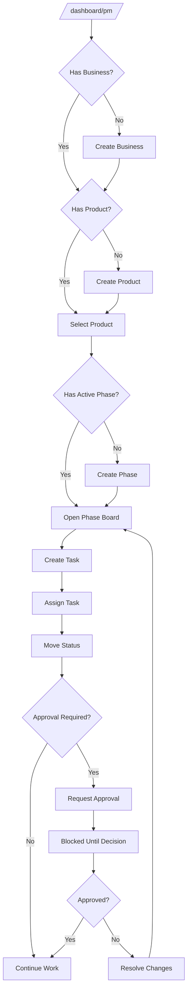
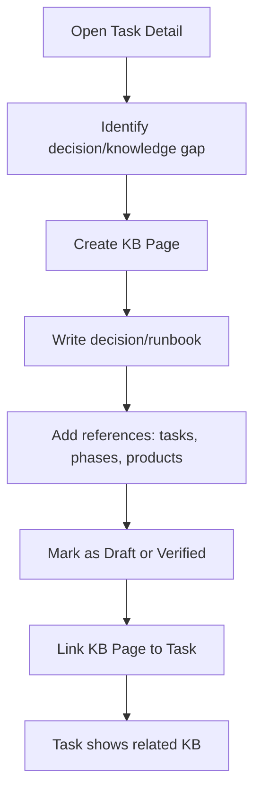
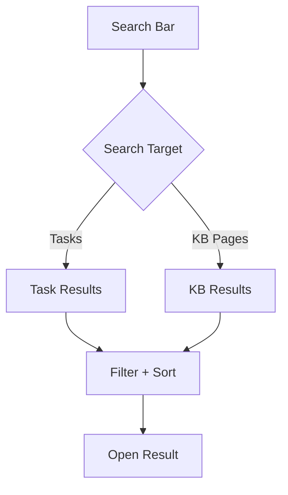

# Core-PM UX Flows (Phase 1–3)

## Legend

1. **P1** = Phase 1 (build now, full detail)
2. **P2** = Phase 2 (design complete, gated)
3. **P3** = Phase 3 (design complete, gated)

---

## Flow 1 (P1): PM Home → Product → Phase → Task Execution



Edge states (P1):

1. Permission denied on create/edit/move → show rationale + “Ask Admin” CTA.
2. Invalid status transition → block with reason + suggested allowed transitions.
3. Approvals overlay → show “Blocked” with approval link and next action.

---

## Flow 2 (P1): Task Detail → KB Decision Capture → Link Back to Task



Edge states (P1):

1. KB page save conflict → show “resolve conflict” (minimally: last-write warning + history link).
2. Missing permissions to verify → allow draft save; block verify with explanation.

---

## Flow 3 (P1): Search (Tasks + KB)



Notes:

1. P1 uses Postgres FTS; embeddings/vector search is gated to later phases.
2. UI must communicate what is searched (title/body/tags) to avoid “AI magic” expectations.

---

## Flow 4 (P1): Admin Governance (Roles + Policies)

```mermaid
flowchart TD
  A[/dashboard/pm/admin] --> B[Roles]
  A --> C[Policies]
  A --> D[Audit View]
  B --> E[Grant/Revoke Permissions]
  C --> F[Configure Approval Rules]
  D --> G[Review Activity]
```

Edge states (P1):

1. Non-admin access → redirect with “insufficient permissions”.
2. Policy changes require approval (optional) → follow approvals overlay pattern.

---

## Flow 5 (P2): Automations + Rules (Design Complete)

Goals:

1. Allow PM/Admin to define rules (e.g., “moving to DONE requires checklist complete”).
2. Allow automations (e.g., “on READY_FOR_DEV assign to team queue”).

Gates:

1. Requires stable event contracts (`pm.*`) and rule evaluation placement (API).
2. Requires audit + replay strategy for deterministic behavior.

---

## Flow 6 (P3): Agent Team Management (Design Complete)

Goals:

1. Manage PM agent team settings and operating modes from Core-PM UI.
2. Tie agent outputs to tasks and KB entries with traceability.

Gates:

1. Requires AgentOS/Core agent team scaffolding and stable “agent run” event model.
2. Requires explicit safety controls (rate limits, approvals, access boundaries).

