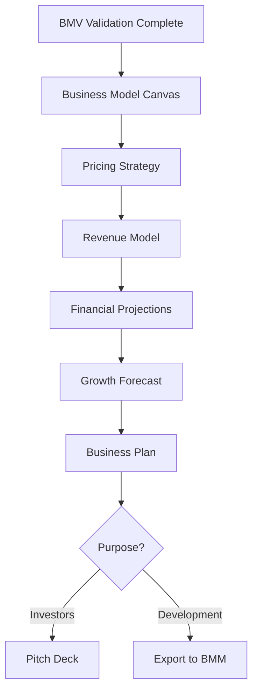

# Business Planning Module (BMP) - Complete Documentation

**Module Code:** bmp
**Version:** 1.0.0
**Layer:** Foundation (PLAN Phase)
**Author:** AI Business Hub Team

---

## Table of Contents

1. [Overview](#overview)
2. [Architecture](#architecture)
3. [Integration Flow](#integration-flow)
4. [Agents](#agents)
5. [Workflows](#workflows)
6. [Tasks](#tasks)
7. [Data Files](#data-files)
8. [Configuration](#configuration)
9. [Usage Guide](#usage-guide)
10. [Anti-Hallucination Protocol](#anti-hallucination-protocol)
11. [Extending BMP](#extending-bmp)

---

## Overview

The Business Planning Module (BMP) is an AI-powered business planning system that transforms validated business concepts into actionable business plans with comprehensive financial models. It serves as the critical bridge between the Business Validation Module (BMV) and the BMAD Method Module (BMM).

### Purpose

BMP helps users:
- Create comprehensive Business Model Canvases
- Build financial projections with unit economics
- Design pricing strategies and revenue models
- Forecast growth with scenario planning
- Generate investor-ready business plans
- Prepare development handoffs for BMM

### Key Capabilities

| Capability | Description |
|------------|-------------|
| Business Model Design | 9-block Business Model Canvas with value proposition |
| Financial Modeling | 3-5 year projections with P&L, cash flow, unit economics |
| Pricing Strategy | Value-based pricing with tier design |
| Revenue Architecture | Revenue stream design and monetization planning |
| Growth Forecasting | Scenario-based growth projections |
| Business Plan Generation | Comprehensive investor-ready documentation |

---

## Architecture

### Module Structure

```
.bmad/bmp/
├── agents/                         # 5 specialized agents
│   ├── planning-orchestrator-agent.agent.yaml
│   ├── business-model-architect-agent.agent.yaml
│   ├── financial-analyst-agent.agent.yaml
│   ├── monetization-strategist-agent.agent.yaml
│   └── growth-forecaster-agent.agent.yaml
│
├── workflows/                      # 9 workflow definitions
│   ├── business-model-canvas/
│   │   ├── workflow.yaml
│   │   ├── instructions.md
│   │   ├── template.md
│   │   └── checklist.md
│   ├── financial-projections/
│   ├── pricing-strategy/
│   ├── revenue-model/
│   ├── growth-forecast/
│   ├── multi-product-planning/     # NEW: Coordinates multiple products
│   ├── business-plan/
│   ├── pitch-deck/
│   └── export-to-development/
│
├── tasks/                          # 4 standalone tasks
│   ├── calculate-unit-economics.xml
│   ├── breakeven-analysis.xml
│   ├── scenario-model.xml
│   └── funding-requirements.xml
│
├── data/                           # Reference data
│   ├── revenue-models.csv
│   ├── pricing-strategies.csv
│   ├── financial-metrics.csv
│   └── business-model-patterns.csv
│
├── _module-installer/
│   └── install-config.yaml
│
├── config.yaml                     # Runtime configuration
└── README.md
```

### Design Principles

1. **Document-Driven Planning**: Each workflow produces a structured markdown document
2. **Assumption Transparency**: All financial projections require documented assumptions
3. **Scenario-Based Thinking**: Conservative/realistic/optimistic scenarios throughout
4. **Integration-Ready**: Outputs designed for BMM consumption
5. **Anti-Hallucination**: Financial claims require sources or explicit uncertainty

---

## Integration Flow

### The Complete Module Pipeline

```
┌─────────────────────────────────────────────────────────────────────────────────────┐
│                           AI BUSINESS HUB MODULE PIPELINE                            │
├─────────────────────────────────────────────────────────────────────────────────────┤
│                                                                                      │
│  ┌─────────┐    ┌─────────┐    ┌─────────┐    ┌─────────┐    ┌───────────────┐     │
│  │   BMV   │───▶│   BMP   │───▶│   BMB   │───▶│  BM-PM  │───▶│    BME-*      │     │
│  │Validate │    │ Plan    │    │ Brand   │    │ Manage  │    │Product Modules│     │
│  └─────────┘    └─────────┘    └─────────┘    └─────────┘    └───────────────┘     │
│       │              │              │              │                  │             │
│       ▼              ▼              ▼              ▼                  ▼             │
│   GO/NO-GO      Business       Brand          Project           PRDs &            │
│   + Products    Plans per      Identity       Orchestration     Development       │
│   Recommended   Product        Guidelines     & Tracking        per Product       │
│                                                                                      │
└─────────────────────────────────────────────────────────────────────────────────────┘

Product Modules (BME-*):
├── BME-COURSE    - Online Courses
├── BME-PODCAST   - Audio Shows
├── BME-BOOK      - Books & eBooks
├── BME-YOUTUBE   - Video Content
├── BME-DIGITAL   - Digital Products
├── BME-SAAS      - Software Products
├── BME-PHYSICAL  - Physical Products
├── BME-ECOMMERCE - Online Stores
└── BME-WEBSITE   - Web Properties
```

### BMP's Role in Multi-Product Planning

BMP receives recommended products from BMV's **product-fit-analysis** workflow and creates:
1. **Business Model Canvas** for each Tier 1 product
2. **Lite Business Model** for each Tier 2 product
3. **Unit Economics** per product
4. **Financial Projections** per product
5. **Cross-Product Synergy Analysis**
6. **Cannibalization Risk Assessment**
7. **Resource Allocation Plan**
8. **Consolidated Portfolio Financials**
9. **Product Roadmap with Launch Sequencing**

### BMV → BMP Data Flow

| BMV Output | BMP Usage |
|------------|-----------|
| Market Sizing (TAM/SAM/SOM) | Revenue ceiling for financial projections |
| Customer Profiles | Business model customer segments |
| Competitive Analysis | Pricing strategy and positioning |
| Validation Score | Planning confidence level |
| Risk Register | Financial risk assessment |

### BMP → BMM Data Flow

| BMP Output | BMM Usage |
|------------|-----------|
| Development Brief | Product brief foundation |
| Feature Priorities | MVP scope definition |
| Success Metrics | KPI targets and acceptance criteria |
| Pricing Strategy | Payment integration requirements |
| Growth Forecast | Release planning and milestones |

---

## Agents

### Agent Architecture

BMP uses 5 specialized agents organized by expertise area:

```
┌─────────────────────────────────────────────────────────────────┐
│                    PLANNING ORCHESTRATOR                        │
│                       (Blueprint)                               │
│              Team Lead - Coordinates All Activities             │
└─────────────────────────────────────────────────────────────────┘
                              │
        ┌─────────────────────┼─────────────────────┐
        │                     │                     │
        ▼                     ▼                     ▼
┌───────────────┐   ┌───────────────┐   ┌───────────────┐
│ BUSINESS      │   │ FINANCIAL     │   │ GROWTH        │
│ MODEL         │   │ ANALYST       │   │ FORECASTER    │
│ ARCHITECT     │   │ (Ledger)      │   │ (Horizon)     │
│ (Canvas)      │   │               │   │               │
└───────────────┘   └───────────────┘   └───────────────┘
        │                     │
        ▼                     ▼
┌───────────────────────────────────────┐
│       MONETIZATION STRATEGIST         │
│              (Mint)                   │
└───────────────────────────────────────┘
```

### Agent Details

#### 1. Planning Orchestrator (Blueprint)

**Type:** Module Agent
**Code:** `planner`

**Role:** Team lead coordinating all business planning activities

**Responsibilities:**
- Coordinate workflow sequence
- Ensure document consistency
- Manage handoffs between stages
- Synthesize outputs into business plan
- Create investor-ready documentation

**Commands:**
- `*help` - Display available commands
- `*status` - Show planning progress
- `*canvas` - Start Business Model Canvas
- `*financials` - Start financial projections
- `*plan` - Generate business plan
- `*export` - Export to BMM

---

#### 2. Business Model Architect (Canvas)

**Type:** Expert Agent
**Code:** `model`

**Role:** Business Model Canvas and value proposition design

**Expertise:**
- Business Model Canvas (Osterwalder)
- Value Proposition Canvas
- Lean Canvas
- Business model patterns
- Partnership strategy

**Frameworks:**
- 9-block Business Model Canvas
- Value Proposition Canvas
- Platform Business Model Canvas

---

#### 3. Financial Analyst (Ledger)

**Type:** Expert Agent
**Code:** `finance`

**Role:** Financial projections and unit economics

**Expertise:**
- Financial modeling (SaaS, e-commerce, marketplace)
- Unit economics (CAC, LTV, payback)
- P&L, cash flow projections
- Breakeven analysis
- Funding requirements

**Key Outputs:**
- Unit economics model
- Pro forma P&L (3-5 years)
- Cash flow projection
- Funding requirements

---

#### 4. Monetization Strategist (Mint)

**Type:** Expert Agent
**Code:** `revenue`

**Role:** Revenue models and pricing strategies

**Expertise:**
- SaaS pricing models
- Freemium optimization
- Value-based pricing
- Usage-based pricing
- Enterprise pricing

**Pricing Models:**
- Subscription (flat, tiered, per-seat)
- Usage-based (metered, credits)
- Freemium
- Marketplace (commission)
- Hybrid

---

#### 5. Growth Forecaster (Horizon)

**Type:** Expert Agent
**Code:** `forecast`

**Role:** Growth projections and scenario planning

**Expertise:**
- Growth modeling
- Customer acquisition curves
- Scenario planning
- Market penetration
- Cohort analysis

**Growth Models:**
- Linear growth
- Exponential growth
- S-curve adoption
- Cohort-based projection

---

## Workflows

### Workflow Summary

| Workflow | Type | Primary Agent | Output |
|----------|------|---------------|--------|
| business-model-canvas | Document | model | Business Model Canvas |
| financial-projections | Document | finance | Financial model |
| pricing-strategy | Document | revenue | Pricing document |
| revenue-model | Document | revenue | Revenue architecture |
| growth-forecast | Document | forecast | Growth projections |
| **multi-product-planning** | **Document** | **planner** | **Multi-product portfolio plan** |
| business-plan | Document | planner | Full business plan |
| pitch-deck | Document | planner | Pitch deck content |
| export-to-development | Action | planner | Development brief |

### Workflow Details

#### 1. Business Model Canvas

Creates comprehensive 9-block Business Model Canvas.

**Blocks:**
1. Customer Segments
2. Value Propositions
3. Channels
4. Customer Relationships
5. Revenue Streams
6. Key Resources
7. Key Activities
8. Key Partnerships
9. Cost Structure

**Invoke:** `/bmad:bmp:workflows:business-model-canvas`

---

#### 2. Financial Projections

Creates 3-5 year financial model with P&L, cash flow, and unit economics.

**Components:**
- Assumptions documentation
- Revenue projections
- Cost projections
- Unit economics (CAC, LTV, payback)
- Pro forma P&L
- Cash flow projection
- Scenario analysis

**Invoke:** `/bmad:bmp:workflows:financial-projections`

---

#### 3. Pricing Strategy

Designs pricing model with tiers and competitive positioning.

**Components:**
- Value analysis
- Competitive pricing landscape
- Pricing model selection
- Tier design
- Pricing psychology
- Evolution roadmap

**Invoke:** `/bmad:bmp:workflows:pricing-strategy`

---

#### 4. Revenue Model

Designs comprehensive revenue model architecture.

**Components:**
- Revenue streams (primary/secondary)
- Revenue model type
- Monetization timeline
- Expansion revenue
- Revenue scenarios

**Invoke:** `/bmad:bmp:workflows:revenue-model`

---

#### 5. Growth Forecast

Creates growth projections with scenario analysis.

**Components:**
- Growth model selection
- Growth lever analysis (AARRR)
- Customer projections
- Scenario comparison
- Key milestones

**Invoke:** `/bmad:bmp:workflows:growth-forecast`

---

#### 6. Multi-Product Planning (NEW)

Creates coordinated business plans for multiple product types from BMV's product-fit analysis.

**Purpose:**
Takes recommended products from BMV and creates:
- Business Model Canvas per Tier 1 product
- Lite business model per Tier 2 product
- Unit economics per product
- Financial projections per product
- Cross-product synergy analysis
- Cannibalization risk assessment
- Resource allocation plan
- Consolidated portfolio financials
- Launch sequence roadmap

**Input Required:**
- Product-fit-analysis document from BMV
- Validated idea document (optional)
- Market research document (optional)
- Planning horizon (default: 3 years)

**Output:**
- Comprehensive multi-product business plan
- JSON structured data for BMB handoff
- Consolidated financial projections

**Synergy Analysis:**
- Content synergies (course → book → video)
- Audience synergies (cross-sell opportunities)
- Resource synergies (shared team, tools)
- Brand synergies (authority building)

**Risk Assessment:**
- Identifies cannibalization risks
- Provides mitigation strategies
- Analyzes pricing conflicts

**Invoke:** `/bmad:bmp:workflows:multi-product-planning`

---

#### 7. Business Plan

Generates comprehensive investor-ready business plan.

**Sections:**
1. Executive Summary
2. Company Description
3. Market Analysis
4. Products/Services
5. Business Model
6. Go-to-Market Strategy
7. Operations Plan
8. Management Team
9. Financial Projections
10. Funding Requirements
11. Appendices

**Invoke:** `/bmad:bmp:workflows:business-plan`

---

#### 8. Pitch Deck

Creates content for 10-slide investor pitch deck.

**Slides:**
1. Title/Hook
2. Problem
3. Solution
4. Market Size
5. Business Model
6. Traction
7. Competition
8. Team
9. Financials
10. The Ask

**Invoke:** `/bmad:bmp:workflows:pitch-deck`

---

#### 8. Export to Development

Transforms planning artifacts to BMM-compatible format.

**Outputs:**
- Product brief
- Feature priorities (MoSCoW)
- Success metrics
- MVP constraints
- Integration requirements

**Invoke:** `/bmad:bmp:workflows:export-to-development`

---

## Tasks

### Standalone Tasks

#### 1. Unit Economics Calculator

Calculates CAC, LTV, LTV:CAC ratio, and payback period.

**Inputs:**
- ARPU (monthly)
- CAC
- Monthly churn rate
- Gross margin

**Outputs:**
- Customer lifetime
- LTV
- LTV:CAC ratio
- Payback period
- Health assessment

**Invoke:** `/bmad:bmp:tasks:calculate-unit-economics`

---

#### 2. Breakeven Analysis

Calculates breakeven point in units and revenue.

**Inputs:**
- Monthly fixed costs
- Price per unit
- Variable cost per unit
- Monthly growth (optional)

**Outputs:**
- Contribution margin
- Breakeven units
- Breakeven revenue
- Time to breakeven

**Invoke:** `/bmad:bmp:tasks:breakeven-analysis`

---

#### 3. Scenario Model

Generates conservative/realistic/optimistic scenarios.

**Adjustments:**
- Conservative: -30% growth, +20% churn, +25% CAC
- Realistic: Baseline values
- Optimistic: +30% growth, -20% churn, -15% CAC

**Invoke:** `/bmad:bmp:tasks:scenario-model`

---

#### 4. Funding Requirements

Calculates funding needs with use of funds.

**Inputs:**
- Monthly burn rate
- Current cash
- Target runway
- Business stage

**Outputs:**
- Funding needed
- Use of funds breakdown
- Post-funding runway
- Stage alignment

**Invoke:** `/bmad:bmp:tasks:funding-requirements`

---

## Data Files

### Reference Data

| File | Purpose | Records |
|------|---------|---------|
| `revenue-models.csv` | Revenue model types with benchmarks | 12 |
| `pricing-strategies.csv` | Pricing strategy options | 10 |
| `financial-metrics.csv` | Key metrics with formulas/benchmarks | 17 |
| `business-model-patterns.csv` | Business model patterns | 12 |

### Data Schema

#### revenue-models.csv
```
model_type,description,best_for,key_metrics,examples
```

#### pricing-strategies.csv
```
strategy,description,when_to_use,implementation,risk
```

#### financial-metrics.csv
```
metric,formula,benchmark_saas,benchmark_ecommerce,benchmark_marketplace,notes
```

#### business-model-patterns.csv
```
pattern,description,key_elements,revenue_implications,examples,bmp_workflow
```

---

## Configuration

### Installation Configuration

Located in `_module-installer/install-config.yaml`:

| Field | Type | Description | Default |
|-------|------|-------------|---------|
| `bmp_output_path` | Interactive | Output document location | output/bmp |
| `projection_years` | Interactive | Years for projections | 5 |
| `default_business_type` | Interactive | Business type for benchmarks | saas |
| `scenario_mode` | Interactive | Number of scenarios | three |
| `default_currency` | Interactive | Currency for financials | USD |

### Static Configuration

| Field | Value | Description |
|-------|-------|-------------|
| `target_ltv_cac` | 3 | Target LTV:CAC ratio |
| `target_payback_months` | 12 | Target CAC payback |
| `target_gross_margin` | 70 | Target gross margin % |
| `target_churn_monthly` | 5 | Target monthly churn % |
| `target_runway_months` | 18 | Target funding runway |

---

## Usage Guide

### Typical Planning Sequence



### Example: Complete Planning Flow

```bash
# 1. Start with Business Model Canvas
/bmad:bmp:workflows:business-model-canvas

# 2. Design pricing strategy
/bmad:bmp:workflows:pricing-strategy

# 3. Design revenue model
/bmad:bmp:workflows:revenue-model

# 4. Create financial projections
/bmad:bmp:workflows:financial-projections

# 5. Project growth
/bmad:bmp:workflows:growth-forecast

# 6. Generate business plan
/bmad:bmp:workflows:business-plan

# 7. For investors
/bmad:bmp:workflows:pitch-deck

# 8. For development
/bmad:bmp:workflows:export-to-development
```

### Quick Calculations

```bash
# Check unit economics viability
/bmad:bmp:tasks:calculate-unit-economics

# Calculate breakeven
/bmad:bmp:tasks:breakeven-analysis

# Generate scenarios
/bmad:bmp:tasks:scenario-model

# Calculate funding needs
/bmad:bmp:tasks:funding-requirements
```

---

## Anti-Hallucination Protocol

### Financial Accuracy Requirements

| Claim Type | Requirement | Label |
|------------|-------------|-------|
| Industry benchmarks | Source citation | [Sourced] |
| Growth rates | Comparable companies | [Benchmarked] |
| Cost estimates | Research or quotes | [Estimated - verify] |
| Projections | Documented assumptions | [Projected] |

### Prohibited Practices

1. **No invented metrics** - All benchmarks require sources
2. **No false precision** - Use ranges for uncertain values
3. **No hidden assumptions** - All assumptions explicit
4. **No optimism bias** - Conservative scenario always included

### Confidence Labels

- **[Sourced]** - Cited from authoritative source
- **[Benchmarked]** - Based on comparable companies
- **[Estimated - verify]** - Educated guess, needs validation
- **[Projected - assumptions stated]** - Based on documented assumptions

---

## Extending BMP

### Adding New Workflows

1. Create workflow directory in `workflows/`
2. Create `workflow.yaml` with configuration
3. Create `instructions.md` with workflow steps
4. Create `template.md` for output format
5. Create `checklist.md` for validation
6. Update module README

### Adding New Tasks

1. Create XML task file in `tasks/`
2. Define inputs, flow, and output format
3. Include anti-hallucination requirements
4. Update module README

### Adding New Agents

1. Create agent YAML in `agents/`
2. Define persona, role, expertise
3. Define commands and workflows
4. Update module README

---

## Research Documentation

For detailed research findings, see:
- `/docs/modules/bmp/research/BMP-RESEARCH-FINDINGS.md`

---

**Module Owner:** AI Business Hub Team
**Part of:** BMAD Module System
**Last Updated:** {{date}}
