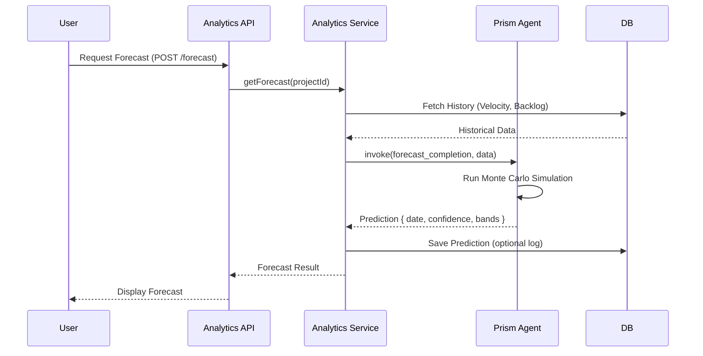
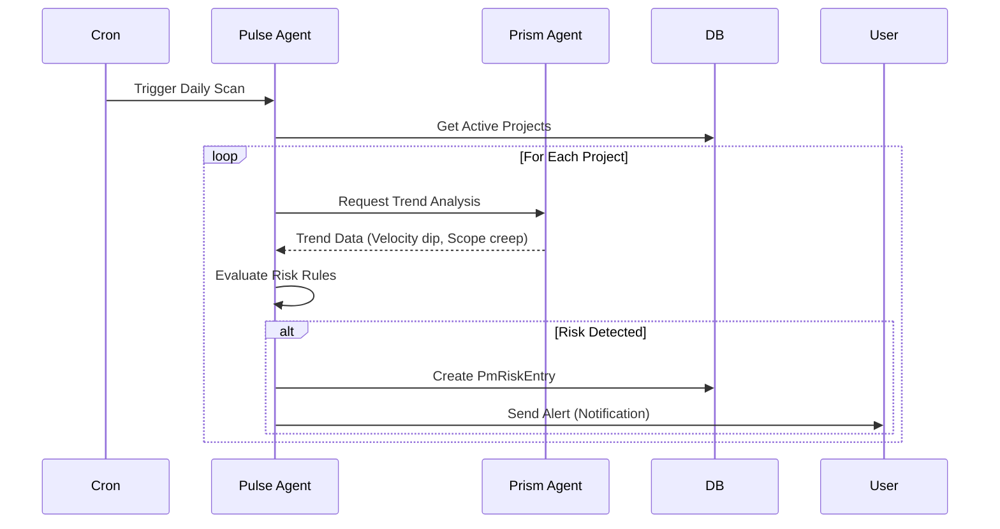

# Epic Technical Specification: PM-08 Prism Agent & Analytics

Date: 2025-12-21
Author: chris
Epic ID: pm-08
Status: Draft

---

## Overview

Epic PM-08 introduces the **Prism Agent**, a specialized AI agent focused on predictive analytics and project optimization, and the associated **Analytics Dashboard**. This epic aims to transform the project management experience from reactive tracking to proactive decision-making. By leveraging historical project data (velocity, task completion rates, scope creep patterns), Prism will provide users with forward-looking insights, such as predicted completion dates, risk forecasts, and resource optimization suggestions.

The implementation includes the Prism agent within the Core-PM agent team, a new Analytics Service in the backend, and a comprehensive set of frontend visualizations (burndown, velocity, trends) powered by these insights. This directly addresses the "Predictive Analytics" and "Reports" functional requirements (FR-6) outlined in the PRD, enabling stakeholders to understand project trajectory and mitigate risks before they impact deadlines.

## Objectives and Scope

**In Scope:**
*   **Prism Agent Implementation:**
    *   Development of the Prism agent using the Agno framework.
    *   Logic for completion forecasting based on historical velocity.
    *   Risk prediction model (schedule, resource, scope risks).
    *   Anomaly detection in project data.
*   **Analytics Backend Service:**
    *   APIs for retrieving aggregated metrics and predictive data.
    *   Data aggregation pipelines for velocity, cycle time, and trends.
*   **Frontend Visualizations:**
    *   Predictive Analytics Dashboard (Wireframe PM-33).
    *   Reports Dashboard (Wireframe PM-15).
    *   Trend visualizations: Velocity (4-week), Scope, Completion Rate.
    *   What-if scenario modeling (interactive sliders).
*   **Export Functionality:**
    *   Exporting reports to PDF and CSV.

**Out of Scope:**
*   **Cross-Workspace Analytics:** Analytics are scoped to the current workspace/project only.
*   **Real-time Machine Learning Training:** The predictive models will use heuristic and statistical methods initially, not real-time training of deep learning models.
*   **External Data Sources:** Analytics will only use internal Core-PM data (tasks, phases, time logs), not external integrations (Jira/GitHub) initially.

## System Architecture Alignment

This epic aligns with the Core-PM architecture as defined in `docs/modules/bm-pm/architecture.md`.

*   **Agent Layer:** Adds **Prism** to the Core-PM Agent Team (`agents/core-pm/prism.py`), fitting into the existing `Team` structure alongside Navi, Sage, and others.
*   **Service Layer:** Introduces `AnalyticsService` (`apps/api/src/core-pm/pm/analytics.service.ts`) to handle heavy aggregation queries and interface with the Prism agent.
*   **Data Layer:** Utilizes existing `Task`, `Phase`, and `Project` models for raw data. Introduces `PmRiskEntry` (or generic `RiskEntry` if shared) and potentially materialized views (`mv_project_metrics`) as suggested in the architecture for performance.
*   **API Layer:** Exposes endpoints under `/api/pm/analytics/*` and `/api/pm/reports/*`.
*   **Frontend:** Extends the PM Dashboard and adds dedicated Analytics views using the existing chart component library (Recharts/Visx).

## Detailed Design

### Services and Modules

| Service/Module | Responsibility | Inputs | Outputs | Owner |
| :--- | :--- | :--- | :--- | :--- |
| **Prism Agent** (`agents/core-pm/prism.py`) | Specialized AI agent for predictive analytics. forecasts completion dates, analyzes trends, and identifies risks based on historical data. | Project History (Tasks, Phases, Velocity), Team Capacity | forecasts, Risk Alerts, Optimization Suggestions | Core-PM Team |
| **Analytics Service** (`apps/api/src/core-pm/pm/analytics.service.ts`) | Backend service to aggregate project data, manage materialized views, and interface with the Prism agent. Serves data to the frontend. | Raw DB Data (Tasks, TimeLogs), API Requests | Aggregated Metrics, JSON Responses | Core-PM Team |
| **Pulse Agent** (Enhancement) | Existing risk agent, enhanced to consume Prism's statistical predictions for broader risk monitoring. | Prism Forecasts, Real-time Task Data | Risk Entries, Alerts | Core-PM Team |
| **Analytics Controller** (`apps/api/src/core-pm/pm/analytics.controller.ts`) | REST API endpoints for the Analytics dashboard and reports. | HTTP Requests | JSON Responses | Core-PM Team |

### Data Models and Contracts

**New Entity: `PmRiskEntry`** (Risk Tracking)

```prisma
model PmRiskEntry {
  id          String   @id @default(cuid())
  projectId   String
  source      String   // "PRISM", "PULSE", "MANUAL"
  category    String   // "SCHEDULE", "RESOURCE", "SCOPE", "BUDGET"
  
  probability Float    // 0.0 - 1.0
  impact      Float    // 0.0 - 1.0
  
  description String
  mitigation  String?
  
  status      String   // "ACTIVE", "MITIGATED", "ACCEPTED", "DISMISSED"
  
  detectedAt  DateTime @default(now())
  updatedAt   DateTime @updatedAt
  
  project     Project  @relation(fields: [projectId], references: [id])
  
  @@index([projectId])
  @@index([status])
}
```

**Materialized View: `mv_project_metrics`** (Performance Optimization)

```sql
CREATE MATERIALIZED VIEW mv_project_metrics AS
SELECT
  p.id as project_id,
  ph.id as phase_id,
  COUNT(t.id) as total_tasks,
  COUNT(t.id) FILTER (WHERE t.status = 'DONE') as completed_tasks,
  SUM(t.story_points) as total_points,
  SUM(t.story_points) FILTER (WHERE t.status = 'DONE') as completed_points,
  AVG(t.actual_hours) as avg_task_duration,
  NOW() as last_refreshed
FROM "Project" p
JOIN "Phase" ph ON p.id = ph.project_id
JOIN "Task" t ON ph.id = t.phase_id
GROUP BY p.id, ph.id;
```

### APIs and Interfaces

**Analytics Endpoints**

*   `GET /api/pm/projects/:projectId/analytics/dashboard`
    *   **Response:** `{ velocity: number, completionPct: number, remainingPoints: number, healthScore: number }`
*   `GET /api/pm/projects/:projectId/analytics/trends`
    *   **Query:** `?range=4w`
    *   **Response:** `{ dates: string[], velocity: number[], scope: number[] }`
*   `POST /api/pm/projects/:projectId/analytics/forecast`
    *   **Body:** `{ scenario?: { addedScope?: number, teamSize?: number } }`
    *   **Response:** `{ predictedDate: string, confidence: "LOW"|"MED"|"HIGH", optimisticDate: string, pessimisticDate: string }`
*   `GET /api/pm/projects/:projectId/analytics/risks`
    *   **Response:** `PmRiskEntry[]`

**Prism Agent Interface**

```python
class PrismTools:
    def forecast_completion(self, project_id: str, history: List[Dict]) -> Dict:
        """Predicts completion date based on velocity trend."""
        pass

    def detect_anomalies(self, data_points: List[float]) -> List[Dict]:
        """Identifies statistical anomalies in project metrics."""
        pass
```

### Workflows and Sequencing

**1. Forecast Generation Workflow**



**2. Automated Risk Scan (Daily)**



## Non-Functional Requirements

### Performance

*   **Dashboard Loading:** Analytics dashboards must load within **800ms** (P95). Heavy aggregations should use materialized views or Redis caching.
*   **Forecast Latency:** Prism agent forecast generation should complete within **3 seconds**. If analyzing >1 year of history, async processing with WebSocket notification is acceptable.
*   **Export Generation:** PDF exports must generate within **5 seconds** for standard reports.

### Security

*   **Workspace Isolation:** All analytics queries must strictly enforce **Row Level Security (RLS)** using `workspaceId`. Cross-workspace data leakage is a critical failure.
*   **Input Validation:** Forecast scenario inputs (e.g., "add 20 points scope") must be sanitized to prevent injection or DoS (e.g., testing with 1M points).
*   **Access Control:** Only users with `PRODUCT_VIEW` or higher can view dashboards. `PRODUCT_UPDATE` is required to run "What-if" scenarios.

### Reliability/Availability

*   **Availability:** 99.9% uptime for the Analytics Service.
*   **Graceful Degradation:** If the Prism Agent is offline or the LLM provider fails, the dashboard must fall back to **basic statistical heuristics** (e.g., linear projection) with a warning badge ("AI Unavailable - using linear projection"). It must not crash.
*   **Data Consistency:** Materialized views must refresh at least every hour, or on-demand when significant changes (e.g., sprint completion) occur.

### Observability

*   **Prediction Tracking:** Log every forecast generated by Prism along with the actual completion date (when it happens) to measure **Model Drift** and accuracy over time.
*   **Performance Metrics:** Track latency for `getDashboard` and `generateForecast` endpoints.
*   **Error Rates:** Alert on >1% failure rate for report generation or Prism agent timeouts.

## Dependencies and Integrations

*   **Agno (Phidata)**: Core agent framework for Prism (`agents/core-pm`).
*   **Python Libraries**:
    *   `numpy`, `scikit-learn` (for statistical forecasting and anomaly detection).
*   **NestJS**: Backend framework (`apps/api`).
*   **Prisma/PostgreSQL**: Database access and materialized views (`packages/db`).
*   **Redis/BullMQ**: Job queue for scheduled risk scans and heavy report generation.
*   **Recharts/Visx**: React chart libraries for the frontend dashboard.
*   **No External Integrations**: This epic strictly uses internal Core-PM data. No Jira/GitHub integrations.

## Acceptance Criteria (Authoritative)

1.  **Prism Agent Foundation**
    *   **AC-1.1:** Prism agent can be initialized and responds to health checks.
    *   **AC-1.2:** Prism can ingest historical project data (tasks, phases) and calculate current velocity.
    *   **AC-1.3:** Prism returns a structured forecast object with date, confidence level, and reasoning.

2.  **Completion Predictions**
    *   **AC-2.1:** Analytics API returns a predicted completion date for a given project.
    *   **AC-2.2:** Prediction includes "optimistic" and "pessimistic" date bands.
    *   **AC-2.3:** Confidence level (Low/Med/High) is calculated based on amount of historical data (e.g., <2 sprints = Low).

3.  **Risk Forecasting**
    *   **AC-3.1:** System identifies "Schedule Risk" if predicted date > target date.
    *   **AC-3.2:** System identifies "Scope Risk" if scope increases >10% mid-phase.
    *   **AC-3.3:** Risk entries are persisted to `PmRiskEntry` table.

4.  **Trend Dashboards**
    *   **AC-4.1:** Dashboard displays Velocity chart showing last 4 weeks/sprints.
    *   **AC-4.2:** Dashboard displays Scope trend (total points over time).
    *   **AC-4.3:** Dashboard loads in <800ms.

5.  **What-If Scenarios**
    *   **AC-5.1:** User can submit a scenario (e.g., "add 20 points") and get an updated forecast without saving to DB.
    *   **AC-5.2:** Scenario forecast returns within 3 seconds.

6.  **Analytics Export**
    *   **AC-6.1:** User can download a PDF summary of the project report.
    *   **AC-6.2:** User can download raw metrics as CSV.

## Traceability Mapping

| Acceptance Criteria | Spec Section | Component/API | Test Idea |
| :--- | :--- | :--- | :--- |
| **AC-1.1, 1.2, 1.3** | Services & Modules | `Prism Agent` | Unit test agent initialization and basic forecasting logic with mock data. |
| **AC-2.1, 2.2** | APIs | `POST /forecast` | Integration test: Seed DB with past sprints, call API, verify date range. |
| **AC-3.1, 3.2, 3.3** | Data Models | `PmRiskEntry`, `Pulse Agent` | End-to-end: trigger risk scan, verify `PmRiskEntry` created for delayed project. |
| **AC-4.1, 4.2** | APIs | `GET /trends` | Integration test: verify JSON structure matches chart requirements. |
| **AC-4.3** | NFR - Performance | `AnalyticsService` | Performance test: Measure response time with 10k tasks. |
| **AC-5.1, 5.2** | Workflows | `POST /forecast` | Functional test: Send scenario payload, verify response differs from baseline. |
| **AC-6.1, 6.2** | Services | `AnalyticsService` | Unit test: Verify PDF/CSV generation logic produces valid files. |

## Risks, Assumptions, Open Questions

**Risks**
*   **Risk:** Insufficient historical data for "Cold Start" projects (newly created).
    *   **Mitigation:** Detect low data volume (<3 sprints) and return "Insufficient Data" state or fallback to global workspace averages with a "Low Confidence" flag.
*   **Risk:** AI Hallucinations in forecast reasoning.
    *   **Mitigation:** Prism should use deterministic statistical models (Monte Carlo, Moving Average) for the *numbers*, and LLM only for *explaining* the numbers.
*   **Risk:** Performance impact of heavy aggregations on the main database.
    *   **Mitigation:** Use Read Replicas for analytics queries if available, and aggressively use the `mv_project_metrics` materialized view.

**Assumptions**
*   Projects use Story Points or Time Estimates consistently. If not, velocity calculations will be invalid.
*   Agno framework supports the required statistical libraries (`numpy`) in the runtime environment.

## Test Strategy Summary

*   **Unit Tests:**
    *   **Prism Agent:** Test forecasting logic with deterministic mock history (e.g., "If velocity is 10 and backlog is 100, forecast 10 weeks").
    *   **AnalyticsService:** Test metric aggregation logic and null handling.
*   **Integration Tests:**
    *   **API -> DB:** Verify `GET /dashboard` correctly sums up task points from the DB.
    *   **Service -> Agent:** Verify `AnalyticsService` can successfully invoke `Prism` and parse the response.
*   **E2E Tests:**
    *   **Dashboard Rendering:** Verify charts render correctly with seed data.
    *   **Scenario Simulation:** Verify "What-If" slider updates the predicted date in the UI.
*   **Data Strategy:**
    *   Use a "Seed Project" with 6 months of generated history (sprints, tasks, completions) to validate trends and forecasting accuracy during CI/CD.
